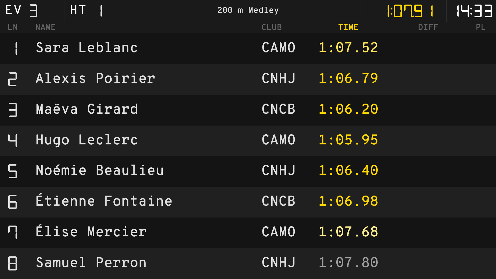
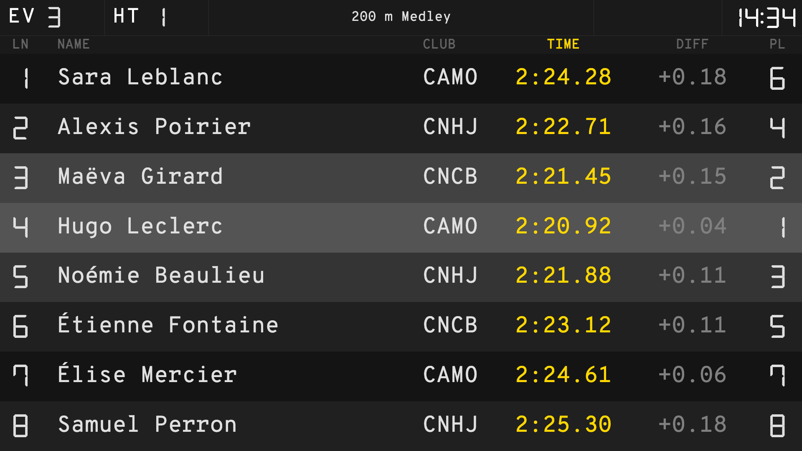
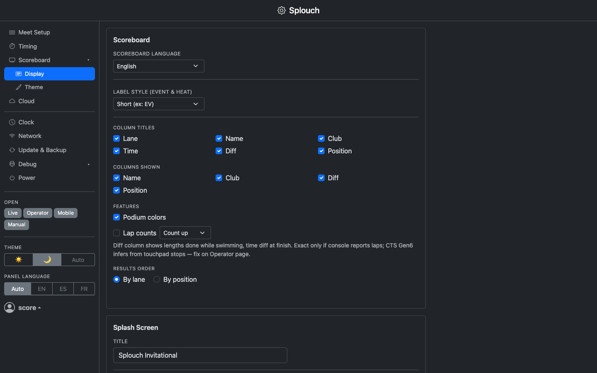
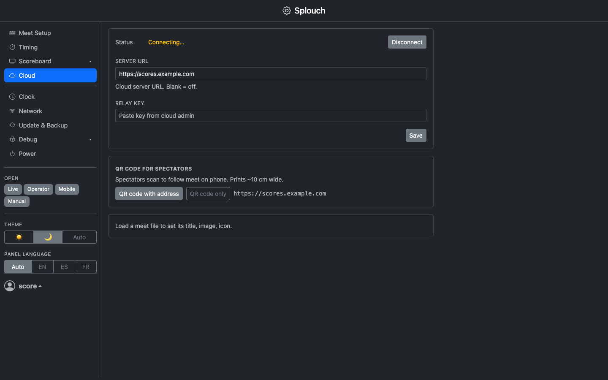

<p align="center">
  
</p>

<p align="center"><a href="#splouch">English</a> · <a href="#splouch-fr">Français</a></p>

# Splouch

[](https://github.com/olivierouellet/Splouch/actions/workflows/ci.yml)
[](LICENSE)

Live swimming scoreboard display for timing consoles.

Decodes the serial feed from the timing console, adds swimmer names and club names from a **Splash Meet Manager** Lenex export, and displays a fullscreen scoreboard on a TV — all on a local network with no internet required at the pool.

Originally inspired by [STU940652/CTS_Scoreboard](https://github.com/STU940652/CTS_Scoreboard).
CTS serial protocol documentation by [hwbrill/vsCTS](https://github.com/hwbrill/vsCTS) and [Marco's Corner](https://marcoscorner.walther-family.org/2015/07/colorado-timing-console-scoreboard-protocol/).

---

## Screenshots

| Mid-race — 100m split held | Finish — places and podium |
| --- | --- |
|  |  |

| Settings — Scoreboard display | Settings — Cloud |
| --- | --- |
|  |  |

Swimmers, clubs and times are fictional (a bundled test recording).

---

## Related repositories

| | |
| --- | --- |
| [Splouch-ios](https://github.com/olivierouellet/Splouch-ios) | Spectator app for iOS |
| [Splouch-android](https://github.com/olivierouellet/Splouch-android) | Spectator app for Android |

---

## Documentation

| | |
| --- | --- |
| [Installation](docs/installation.md) | Pi #1 (server), Pi #2 (kiosk), updating, reinstalling |
| [Admin guide](docs/admin.md) | Meet-day workflow, settings tabs, pages, localisation |
| [Cloud relay](docs/cloud.md) | Public scoreboard for remote attendees |
| [Troubleshooting](docs/troubleshooting.md) | `splouch.local` unreachable, browser stuck on https, `apt` behind a proxy |
| [Development](docs/development.md) | Data flow, adding a console decoder, bundled assets |
| [API contract](docs/api.md) | WebSocket + REST contract for native clients (TV / iOS / Android) |
| [Mobile feature contract](docs/app.md) | What a spectator can see and do on a phone, for the web, iOS and Android clients · [web parity](docs/web-parity.md) |

---

## Supported Consoles

| Console | Status | Doc |
| --- | --- | --- |
| Colorado Time Systems — System 5 / System 6 / Gen7 Legacy | ✅ Tested | [cts-gen6.md](docs/consoles/cts-gen6.md) |
| Colorado Time Systems — Gen7 Serial | ⚠️ Untested | [cts-gen7.md](docs/consoles/cts-gen7.md) |
| Daktronics Omnisport 2000 | ⚠️ Untested | [omnisport-2000.md](docs/consoles/omnisport-2000.md) |
| Swiss Timing Omega — Ares 21 | ⚠️ Untested | [ares-21.md](docs/consoles/ares-21.md) |
| Swiss Timing Omega — Quantum | ⚠️ Untested | [quantum.md](docs/consoles/quantum.md) |
| Manual — no timing console | ✅ Tested | [manual.md](docs/consoles/manual.md) |

---

## Network

```text
Timing console
      │
   Serial adapter (see console doc)
      │
  Pi #1 ── eth0 ──┐
                  ├── Router ── internet (Cloud)
  Pi #2 ── eth0 ──┤
  Laptop ─────────┘
```

| Device | Address | Role |
| --- | --- | --- |
| Pi #1 | `http://splouch.local` | Serial decoder + FastAPI server + admin UI |
| Pi #2 | automatic | Qt kiosk — fullscreen scoreboard on TV |

A router is required — it assigns addresses (DHCP) and gives Pi #1 the internet access the
Cloud needs. No device needs a fixed IP: everything reaches Pi #1 by name (`splouch.local`,
via mDNS).

| Item | Purpose |
| --- | --- |
| Raspberry Pi 3B+ or 4 | Pi #1 — scoreboard server |
| Raspberry Pi 4 | Pi #2 — TV kiosk |
| Router + Cat5e cables | Connect all pool-deck devices and reach the Cloud |

---

## Requirements

| | Minimum |
| --- | --- |
| Raspberry Pi OS | **Trixie** (October 2025) |
| Python | **3.13** (included in Trixie) |

---

## Quick install

Flash **Raspberry Pi OS Trixie** on each Pi with SSH enabled, then run on each:

```bash
curl -fsSL https://raw.githubusercontent.com/olivierouellet/Splouch/master/install/install.sh -o install.sh && bash install.sh
```

The script asks which role to install: **Server**, **Kiosk**, or **Cloud**. See [docs/installation.md](docs/installation.md) for details.

---

## Community

| | |
| --- | --- |
| [Contributing](CONTRIBUTING.md) | Setup, the checks a PR must pass, conventions, reporting a bug |
| [Security](SECURITY.md) | Reporting a vulnerability, what Splouch assumes about the network |
| [Code of Conduct](CODE_OF_CONDUCT.md) | Contributor Covenant 2.1 |

---

<a id="splouch-fr"></a>

## Splouch — Français

<p><a href="#splouch">English</a> · <a href="#splouch-fr">Français</a></p>

Tableau d'affichage de natation en direct pour consoles de chronométrage.

Décode le flux série de la console de chronométrage, ajoute le nom des nageurs et des clubs à partir d'un export Lenex de **Splash Meet Manager**, et affiche un tableau plein écran sur un téléviseur — le tout sur un réseau local, sans internet requis à la piscine.

Inspiré à l'origine de [STU940652/CTS_Scoreboard](https://github.com/STU940652/CTS_Scoreboard).
Documentation du protocole série CTS par [hwbrill/vsCTS](https://github.com/hwbrill/vsCTS) et [Marco's Corner](https://marcoscorner.walther-family.org/2015/07/colorado-timing-console-scoreboard-protocol/).

---

## Captures d'écran

| En course — temps de passage au 100 m | Arrivée — classement et podium |
| --- | --- |
|  |  |

| Réglages — Affichage du tableau | Réglages — Cloud |
| --- | --- |
|  |  |

Nageurs, clubs et temps fictifs (enregistrement de test inclus).

---

## Dépôts associés

| | |
| --- | --- |
| [Splouch-ios](https://github.com/olivierouellet/Splouch-ios) | Application spectateur pour iOS |
| [Splouch-android](https://github.com/olivierouellet/Splouch-android) | Application spectateur pour Android |

---

## Guides et documentation

Les trois derniers documents n'existent qu'en anglais.

| | |
| --- | --- |
| [Installation](docs/installation.md#installation-fr) | Pi n° 1 (serveur), Pi n° 2 (kiosque), mise à jour, réinstallation |
| [Guide d'administration](docs/admin.md#admin-guide-fr) | Déroulement d'une compétition, onglets des réglages, pages, localisation |
| [Relais cloud](docs/cloud.md#cloud-relay-fr) | Tableau public pour les spectateurs à distance |
| [Dépannage](docs/troubleshooting.md#troubleshooting-fr) | `splouch.local` injoignable, navigateur bloqué en https, `apt` derrière un proxy |
| [Développement](docs/development.md) | Flux de données, ajout d'un décodeur de console, ressources incluses *(en anglais)* |
| [Contrat d'API](docs/api.md) | Contrat WebSocket + REST pour les clients natifs (TV / iOS / Android) *(en anglais)* |
| [Contrat fonctionnel mobile](docs/app.md) | Ce qu'un spectateur peut voir et faire sur un téléphone, pour les clients web, iOS et Android · [parité web](docs/web-parity.md) *(en anglais)* |

---

## Consoles prises en charge

| Console | État | Doc |
| --- | --- | --- |
| Colorado Time Systems — System 5 / System 6 / Gen7 Legacy | ✅ Testée | [cts-gen6.md](docs/consoles/cts-gen6.md) |
| Colorado Time Systems — Gen7 Serial | ⚠️ Non testée | [cts-gen7.md](docs/consoles/cts-gen7.md) |
| Daktronics Omnisport 2000 | ⚠️ Non testée | [omnisport-2000.md](docs/consoles/omnisport-2000.md) |
| Swiss Timing Omega — Ares 21 | ⚠️ Non testée | [ares-21.md](docs/consoles/ares-21.md) |
| Swiss Timing Omega — Quantum | ⚠️ Non testée | [quantum.md](docs/consoles/quantum.md) |
| Manuel — sans console de chronométrage | ✅ Testé | [manual.md](docs/consoles/manual.md) |

---

## Réseau

```text
Console de chronométrage
      │
   Adaptateur série (voir la doc de la console)
      │
  Pi n° 1 ── eth0 ──┐
                    ├── Routeur ── internet (Cloud)
  Pi n° 2 ── eth0 ──┤
  Portable ─────────┘
```

| Appareil | Adresse | Rôle |
| --- | --- | --- |
| Pi n° 1 | `http://splouch.local` | Décodeur série + serveur FastAPI + interface d'administration |
| Pi n° 2 | automatique | Kiosque Qt — tableau plein écran sur le téléviseur |

Un routeur est requis — il attribue les adresses (DHCP) et donne au Pi n° 1 l'accès
internet dont le Cloud a besoin. Aucun appareil n'a besoin d'une IP fixe : tout joint le
Pi n° 1 par son nom (`splouch.local`, via mDNS).

| Matériel | Utilité |
| --- | --- |
| Raspberry Pi 3B+ ou 4 | Pi n° 1 — serveur du tableau |
| Raspberry Pi 4 | Pi n° 2 — kiosque TV |
| Routeur + câbles Cat5e | Relier les appareils du bord de piscine et joindre le Cloud |

---

## Prérequis

| | Minimum |
| --- | --- |
| Raspberry Pi OS | **Trixie** (octobre 2025) |
| Python | **3.13** (inclus dans Trixie) |

---

## Installation rapide

Flashez **Raspberry Pi OS Trixie** sur chaque Pi avec SSH activé, puis lancez sur chacun :

```bash
curl -fsSL https://raw.githubusercontent.com/olivierouellet/Splouch/master/install/install.sh -o install.sh && bash install.sh
```

Le script demande quel rôle installer : **Server**, **Kiosk** ou **Cloud**. Voir [docs/installation.md](docs/installation.md) pour les détails.

---

## Communauté

| | |
| --- | --- |
| [Contribuer](CONTRIBUTING.md) | Mise en place, vérifications requises pour une PR, conventions, signaler un bogue |
| [Sécurité](SECURITY.md) | Signaler une vulnérabilité, ce que Splouch suppose du réseau |
| [Code de conduite](CODE_OF_CONDUCT.md) | Contributor Covenant 2.1 |
