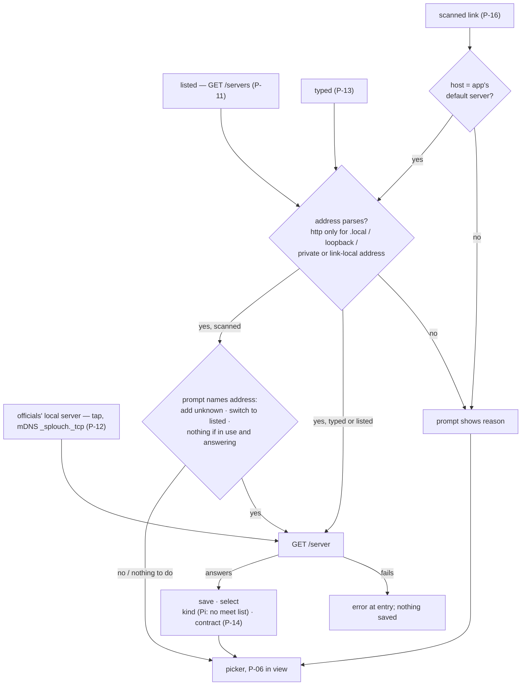
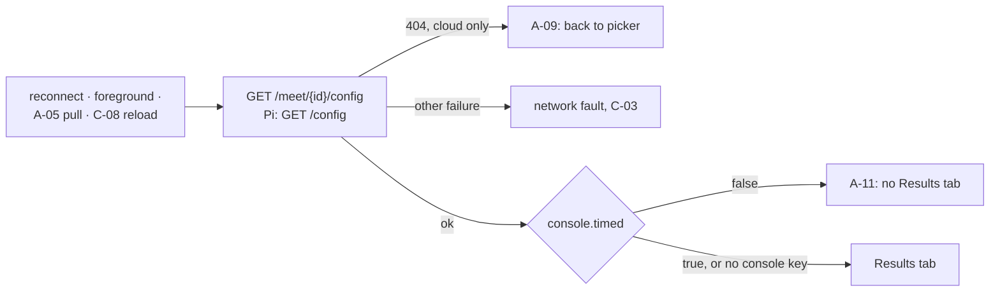
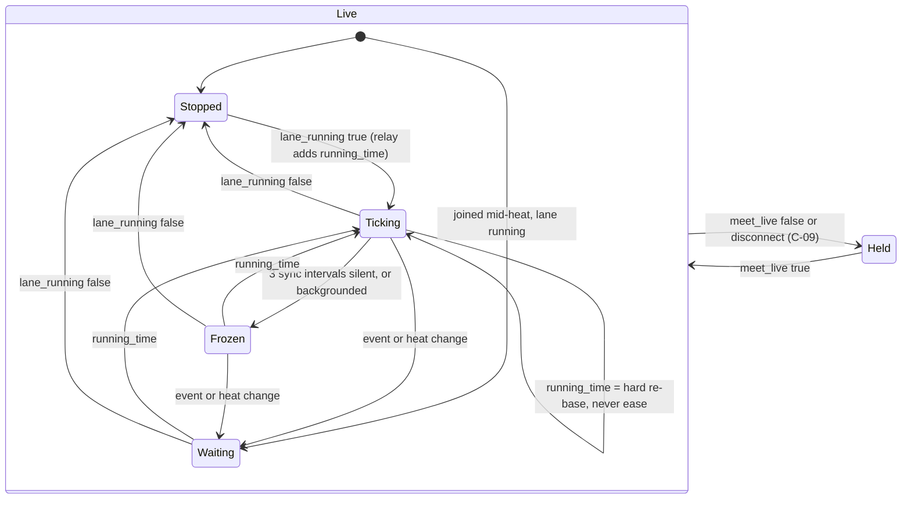
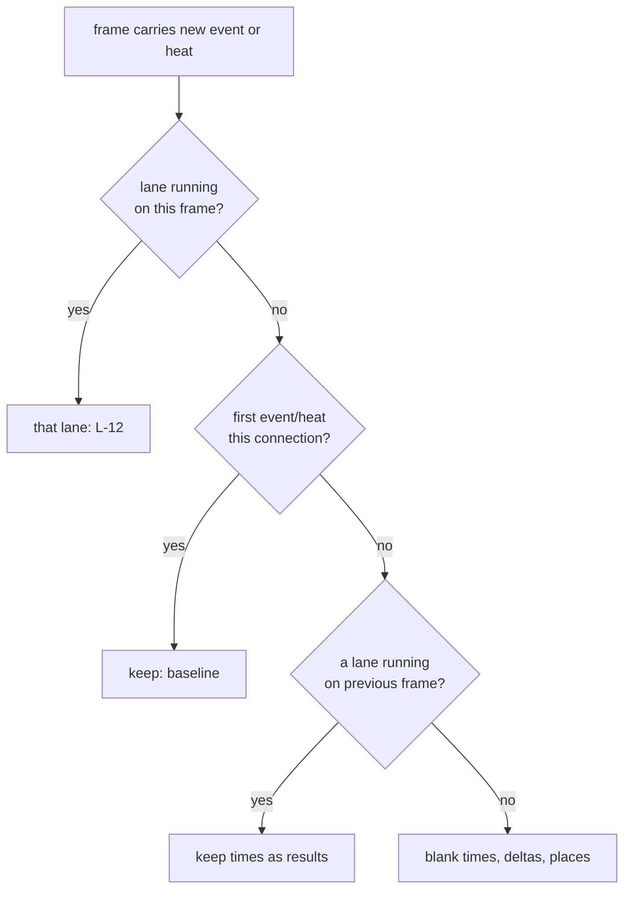
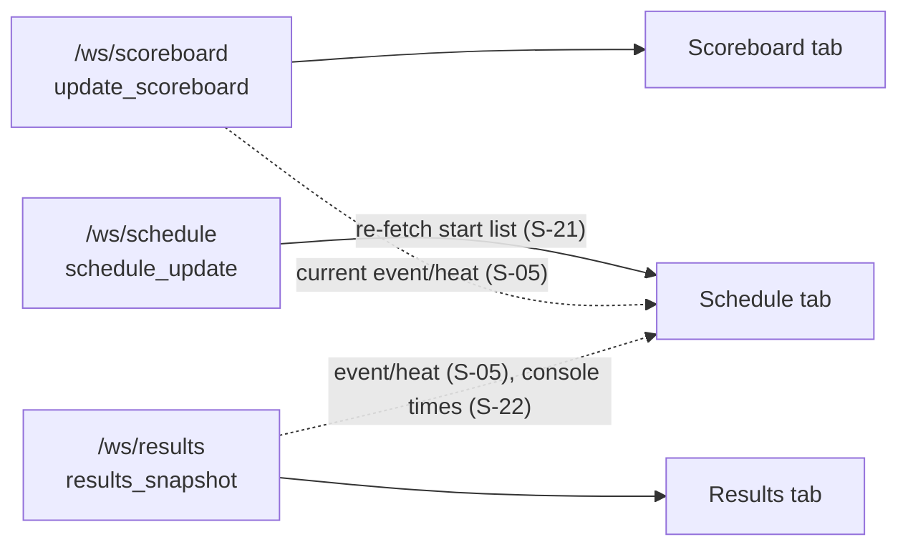
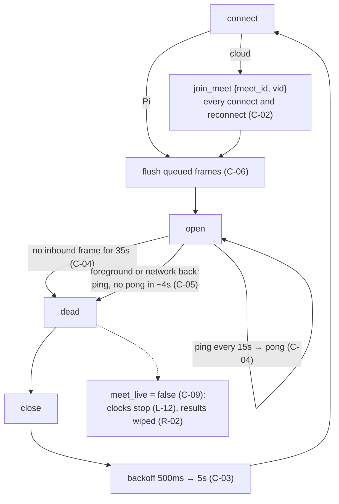
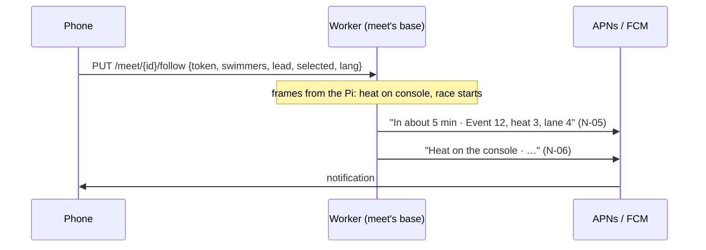

# Splouch mobile — feature contract

**Contract version: `v3`** · Clients: web phone pages (this repo), `Splouch-ios`,
`Splouch-android` (§0.1).

*Behaviour* contract: what a spectator sees/does on a phone, and what drives it. Binds all
three clients, web included — web disagrees with this text → web is behind.

[`api.md`](api.md) = *data* contract: sockets, events, payloads.

---

## 0. How to use this file

### 0.1 Who owns what

| | Owns | Lives in |
| --- | --- | --- |
| **This file** | *what* each feature is, its driver, its scope and level | Splouch (this repo) |
| **Parity ledger** | *whether* built on that client, and why not | [`web-parity.md`](web-parity.md) here; `parity.md` in `Splouch-ios`, `Splouch-android` |

One ledger row per ID; **no per-client status here.** Ledger note: where it lives, what
tests it, last seen on device. Why it exists = this file.

| Status | Meaning |
| --- | --- |
| `done` | built as described, within §0.4's latitude |
| `deferred` | not built yet |
| `diverges` | built, deliberately different; note says what and why. **Temporary**: within a release, this file absorbs it or client reverts |
| `n/a — <reason>` | scope or level excludes this client (§0.3) |

IDs = join key across repos: **never renumber**. Retired → keeps ID, `**retired**` note.
New → next free number in section, claimed here (one-line row OK) before any ledger uses it.

### 0.2 What a client connects to

Default: **cloud relay** ([`api.md`](api.md) §3). App (not web) may also point at another
cloud or a Pi on pool network (`P-11`–`P-13`); kind changes session shape (Pi: one meet,
no picker) → client asks `GET /server`. Both servers render same templates; only
difference is `MEET_ID` set or not:

| Surface | Web template |
| --- | --- |
| meet picker | [`cloud/templates/picker.html`](../cloud/templates/picker.html) — cloud-only |
| app shell / tabs | [`shared/templates/mobile.html`](../shared/templates/mobile.html) |
| Scoreboard tab | [`shared/templates/live-mobile.html`](../shared/templates/live-mobile.html) + [`shared/templates/scoreboard_base.html`](../shared/templates/scoreboard_base.html) |
| Results tab | [`shared/templates/results.html`](../shared/templates/results.html) + `scoreboard_base.html` |
| Schedule tab | [`shared/templates/schedule.html`](../shared/templates/schedule.html) |
| socket client | [`shared/static/js/ws.js`](../shared/static/js/ws.js) |

Kiosk-only features: §9.

All phone data reachable as JSON ([`api.md`](api.md) §4). Each page renders from the
helper its JSON endpoint returns (`_public_meet_list`, `_build_heats_json`,
`_picker_branding`, Pi's `build_heats`) → field added for one reaches other. Extend the
helper, never the route.

**Pi session = same app, other addresses.** Once `GET /server` → `kind: "pi"`:

| Needed for | Cloud | Pi |
| --- | --- | --- |
| meet config, theme, labels (`P-08`, `T-*`) | `GET /meet/{id}/config` → `settings` | `GET /config` (same keys, flattened) |
| meet name in shell | `GET /meet/{id}/config` → `app_window_title`, then `name` | `GET /config` → `meet_title` |
| start list (`S-01`, `S-09` index) | `GET /meet/{id}/schedule` | `GET /schedule.json` |
| strings (`T-05`) | `GET /i18n/{lang}` | `GET /i18n/{lang}` |
| `join_meet` (`C-02`) | every connect | **never** — Pi pushes on connect |
| `vid` (`C-10`) | one per server | none |
| meet gone (`A-09`) | `GET /meet/{id}/config` → 404 | n/a — one meet; unreachable Pi = `C-03` |
| meet picker (`P-*`) | launch screen | skipped — `P-11` server list only |

### 0.3 Scope and level

Every row has both.

| Scope | Meaning |
| --- | --- |
| **all** | every client |
| **web** | browser artifact; native satisfies by existing, or not at all |
| **native** | mirror: meaningless on web. E.g. server selection — page origin *is* its server |

| Level | Meaning |
| --- | --- |
| **must** | not at parity without it |
| **should** | expected; first release may ship without |
| **n/a** | in Pi/kiosk product, deliberately absent from mobile |

A linked ID (`[P-06]`) has a note below its table.

### 0.4 Describe behaviour, not markup

Rows = observable behaviour + data source. HTML accidents flagged as such. **Copying a
workaround ≠ parity** — implement effect, not mechanism:

| Web mechanism | Why on web | Native equivalent |
| --- | --- | --- |
| 28px edge strips for swipe (`A-03`) | full-width listener would eat touches for schedule list in the `<iframe>` tab | platform's peer-section nav — full-width finger-following pager where idiomatic (`A-10`), tab bar alone otherwise |
| `@media (orientation: …)` (`A-07`, `L-15`, `L-16`) | only CSS layout switch when written | window width — full table from 600pt/dp/px |
| `sessionStorage['tab']` (`A-04`) | page restores no state itself | platform state restoration |
| 80px pull threshold, rotating indicator (`A-05`) | hand-rolled; no browser refresh control | platform refresh control |
| `env(safe-area-inset-*)` (`A-06`) | only way page learns notch | safe-area guides — free |
| `<title>`, `apple-mobile-web-app-title`, manifest `name` (`A-08`) | browser tab, installed icon label | none — store listing sets label (Android may set `TaskDescription`) |
| parent re-dispatches `resize`; `contentWindow.on_tab_shown()` (`L-14`, `R-10`) | `<iframe>` never told it's revealed | on-appear callback |
| `#edgeT` / `#filter-header` 65px alignment in `mobile.html` | two documents line up as one screen | none — one view |
| ~220ms debounce on filter search (`S-09`) | each keystroke hit server for names page already had | none — local index, wait = lag |
| one `scrollWidth`/`clientWidth` ratio on gated frame (`L-17`) | CSS can't shrink-to-fit text | `UILabel.adjustsFontSizeToFitWidth`, Android `autoSizeTextType` |

Right column = requirement. Platform better (`A-03` gesture, `L-17` auto-shrink) → web is
floor. Platform idiom narrower → idiom wins; row says what survives.

**Row requires** observable outcome + data source: what spectator sees/does, which words,
which field. Unless row says otherwise, client chooses:

- **where** a control sits — bar, top/bottom, menu, sheet;
- **which** platform component — system search field, pager, rail;
- sizes, spacing, type scale, cell grouping within a row;
- window adaptation, within rows' 600-wide split.

Using this latitude = `done`, not `diverges`. Rows needing placement/format say so
(`P-06` above meets, `S-01` heading).

### 0.5 Notation and terms

| Notation | Means |
| --- | --- |
| `→` | leads to, becomes, then |
| `=` | is, means |
| `≠` | is not |
| `⇒` | implies |
| `w/o` | without |
| `<i>` | lane number, 1 to `num_lanes` — `lane_time<i>` is lane *i*'s time |
| `settings.*` | meet config (§0.2) |
| `strings.*` | `GET /picker/config` → `strings` |
| `mobile.*` | `GET /i18n/{lang}` → `mobile`, the `[mobile]` table of the locale files |

| Term | Means |
| --- | --- |
| **spectator** | the person holding the phone |
| **cloud relay** | public server phones reach by default; Pis push their meets to it ([`api.md`](api.md) §3) |
| **Pi** | the server at the pool, wired to the timing console; holds one meet |
| **console** | the timing console (Quantum, CTS, Omnisport, ARES…) the Pi reads |
| **kiosk** | the pool's big board — `server/templates/live.html` and the Qt display; not a phone |
| **meet · event · heat** | the competition · one race type (`200 m backstroke, girls < 12`) · one swim of an event, a swimmer per lane |
| **split · length** | a lane's time at a wall touch · one pool length (a "lap" on screen) |
| **frame** | one `update_scoreboard` message; partial (`L-10`) |
| **snapshot** | one `results_snapshot`: a heat's results |
| **start list** | every heat with its entries — the Schedule tab (`S-01`) |
| **`meet_live`** | server's flag that the feed is live; false, or a disconnect, holds the board (`C-09`) |

---

## 1. Meet picker (`P`)

Entry screen. Web: site root. App: launch screen, and `A-02`'s return target.

| ID | Feature | Driven by | Scope | Level |
| --- | --- | --- | --- | --- |
| `P-01` | Meets as cards: name, date, location, sport, and the organizer's state/province and country (country named in the reader's language; state/province named in full when the client knows it — its own name, never translated: *Québec*, *Nuevo León* — else as sent) | `GET /meets` ([`api.md`](api.md) §5.6) → `country` (ISO code), `province` (free text); names from [`shared/regions/subdivisions.json`](../shared/regions/subdivisions.json) (CA, US, MX), matched by code or listed spelling, folded (`S-09`) | all | must |
| `P-02` | Per-meet picker image on card, if supplied — only while the list is short (`P-18`) | `settings.picker_image_b64` → `GET /picker_image/{meet_id}` | all | should |
| `P-03` | Offline meets stay listed, dimmed dot; opened → last scoreboard frame, empty Results (`R-02`) | `offline`: retained, no relay connected | all | must |
| `P-04` | Empty state, no active meets | `strings.no_meets` | all | must |
| `P-05` | Branding: title + logo above/below, sized by aspect ratio within list width under height cap. Picker chrome in **device's** language, not a meet's (list spans meets in many languages; per-meet from `T-06`) | `GET /picker/config?lang=` or `Accept-Language` → `title`, `has_logo`, `logo_above`; `GET /picker_logo` (PNG/JPEG/GIF/WebP; an SVG logo comes as SVG only to an `Accept` naming `image/svg+xml`, else as a PNG copy — read `Content-Type`) | all | should |
| [`P-06`](#p-06) | Unofficial-results disclaimer **above** meets as one quiet line — hourglass + short text, always shown, no fold; tap → full server text, platform's way. Full text also in onboarding (`P-20`) and settings About (`P-19`) | `GET /picker/config` → `strings.results_disclaimer`, `results_disclaimer_short` | all | **must** |
| [`P-07`](#p-07) | Whenever attendance counting is on for the server: **Privacy** section in settings (`P-19`) — counting toggle (`C-10`), server's privacy note under it, link to server's policy. **Not on picker** | `strings.privacy_note`, gated on `analytics_enabled`; policy at server's `GET /privacy`; toggle words native in apps (`T-05`), web reads `strings.privacy_count`, `privacy_policy` | all | must |
| `P-08` | Select meet → app shell | `GET /meet/{id}/config` | all | must |
| `P-09` | Pull-to-refresh re-fetches list | — | all | should |
| `P-10` | Install hand-off: store links once apps ship, Add-to-Home-Screen until then. In an app the slot renders nothing | `stores` ([`api.md`](api.md) §5.7), per platform, present once listed → no deploy on move, absent hides button; `P-16`'s `GET /add` uses same dict | web | should |
| [`P-11`](#p-11) | Pick server from list in settings (`P-19`). Meet list names it only when it is not the app's default (`https://splouch.org`); a meet names it when not default | `GET /servers` ([`api.md`](api.md) §5.11), each checked via `GET /server` | native | must |
| [`P-12`](#p-12) | LAN servers offered without typing — on tap, in server sheet section *Officials' local server*; one ~10 s scan, finds listed until sheet closes, none → *No server found*; *Search again* rescans | mDNS browse `_splouch._tcp` (not `splouch.local`), only after tap, ~10 s then stopped (sheet closing or app backgrounding stops it sooner); words native (`T-05`) | native | should |
| [`P-13`](#p-11) | Add server by hand, checked before save | `GET /server` must answer | native | must |
| `P-14` | Server on other contract versions → one-line notice naming both, once per session, beside server name; **never blocks connect** (newer = additive, older degrades a feature, e.g. `L-12` clock vs v1 relay) | `GET /server` → `contract.api`, `contract.app` ([`api.md`](api.md) §5.10) | native | should |
| [`P-15`](#p-15) | Spectator's Appearance — Dark (default), Light, Automatic — in settings (`P-19`), applies on every screen of every meet | stored pref; server's two palettes ([`api.md`](api.md) §6.1), never `settings.theme_colors`; words native in apps (`T-05`); web reads `strings.appearance`, `appearance_dark` / `_light` / `_auto` | all | should |
| [`P-16`](#p-11) | QR scan adds server: app asks; yes → adds, selects, lands on **meet list**. No app → page offers store | `https://<default host>/add?server=<origin>`; host's two `/.well-known/` files, `GET /add` ([`api.md`](api.md) §4) | native | should |
| [`P-17`](#p-17) | Search meet list from **3** meets, narrows as typed, own empty state; field where platform puts search | local over `GET /meets` → `name`, `meet_date`, `location`, `sport`, `organizer`, `province`, `country` (code and reader's-language name); `strings.meet_search`, `no_meets_match` | all | should |
| `P-18` | More than **10** meets → compact rows: name, date, location, province/country, live dot; **no picker image**, none fetched. 10 or fewer → `P-01` cards | count of `GET /meets` → `meets` | all | should |
| [`P-19`](#p-19) | **Settings** — one container in place of picker menu, sections in this order: Display (language `T-08`, Appearance `P-15`), Privacy (`P-07`), Server (`P-11`–`P-13`, native), About (`P-06` full text, policy link, `P-20` replay). Platform's own form: web side sheet (full height under 600px), iOS sheet with `Form`, Android full-screen settings destination | section names native in apps (`T-05`); web reads `strings.settings`, `settings_display`, `settings_privacy`, `settings_about` | all | should |
| [`P-20`](#p-20) | **Introduction** on first launch, once per install, replayable from settings About: unofficial results (`P-06`), three tabs, following a swimmer or club, attendance counting with its toggle (`C-10`) | pages 1 and 4 server text (`results_disclaimer`, `privacy_note`), rest native words (`T-05`); page 4 only while `analytics_enabled` | native | should |
| [`P-21`](#p-21) | **Filter** the meet list by country, state/province and club (organizer), several values each; **remembered** by the app across launches and servers. Each facet lists the values the list holds; OR within a facet, AND across. Active filter → a line at the end of the list says meets are hidden, with *Clear*; filter hides every meet → own empty state with *Clear*, not `P-04`/`P-17`'s | local over `GET /meets` → `country`, `province`, `organizer`; stored pref, one per app; words native (`T-05`) | native | should |

### <a id="p-06"></a>P-06 — one line, always there

**`P-06` not decoration.** Only thing between live feed and spectator taking it as
result → on meet list, never only in About or onboarding; renders server text
(rewording w/o store review). Onboarding (`P-20`) is seen once, by the first server;
QR arrivals (`P-16`), a second server and every web visitor never see it.

**Quiet, not foldable.** The folding banner stood in the way; a line nobody can close
needs no X, pill, stored fold or focus hand-off. Above meets, under title/logo (below,
a season of meets hides it); above `P-17` field or not, by platform search placement.
Icon same on all clients: **hourglass** (SF `hourglass`, Material `hourglass_top`,
Lucide `hourglass`).

| | Line | Tap |
| --- | --- | --- |
| Web | caption under title, `results_disclaimer_short` · *Details* | `<details>`: full text inline |
| iOS | list `Section` header, `Label` in `.footnote`, `.secondary` | sheet, `.presentationDetents([.medium])`; popover on iPad |
| Android | list header item, `bodySmall`, `onSurfaceVariant` | `ModalBottomSheet` |

**Only once server has sent text.** No `GET /picker/config` yet (first launch, offline)
→ no line, on every client: it is that server's words about that server's results,
never a snapshot's copy.

### <a id="p-07"></a>P-07 — privacy note lives with its toggle

**Moved off picker.** Note beside `P-06` was a second banner on every visit, about
something the spectator could not change. Now it can (`C-10`), so it sits where the
change is made: Privacy section of settings, toggle first, server's `privacy_note`
under it as the toggle's explanation, then the server's policy link.

- **Section only while `analytics_enabled`.** Counting off → no section, no toggle;
  the spectator's stored choice is kept for when it comes back on.
- **Note is server text** (rewording without store review, as `P-06`); toggle label
  and section name are the app's own words.
- **No first-launch prompt.** Counting is on by default and refusable (`C-10`): the
  policy and the setting are the notice, not a dialog.

### <a id="p-19"></a>P-19 — settings, not a menu

Menu held three choices; settings now hold a toggle, explanatory text and links,
which a popover or `DropdownMenu` renders badly. One container, sections in this
order, each platform's own form. Display first: it is what most spectators open
settings for; Server is for the few who follow a pool's own server, so it sits below:

| Section | Holds | Web | iOS | Android |
| --- | --- | --- | --- | --- |
| Display | language (`T-08`), Appearance (`P-15`) | radio groups | language row → list, Appearance `Picker` | language row → dialog, Appearance radio rows |
| Privacy | `P-07` | toggle + note + link | `Toggle`, footer note + `Link` | `Switch` row, supporting text, link |
| Server | `P-11`–`P-13`, `P-14` notice | — (no server choice) | row with current server → server list | row → server sheet |
| About | `P-06` full text, policy link, *Show introduction* (`P-20`, native), app version | text | `Section` text | text |

Opened from a **gear**, not ☰ or ⋮: web fixed button where ☰ was, iOS toolbar item,
Android top app bar action. Closing returns to picker with list and query intact.

### <a id="p-20"></a>P-20 — introduction

Four short pages — icon, title, one or two sentences — paged, skippable from the
first, ending on the picker. iOS: full-screen cover, `TabView` `.page` style; Android:
full-screen `HorizontalPager` with dots. Not on web: a visitor arriving mid-meet from a
QR code needs the board, not a carousel; `P-06`'s line does the job there.

1. **Unofficial results** — server's `results_disclaimer`, in full.
2. **Three tabs** — Scoreboard (heat in the water), Results (finished heats), Schedule
   (start lists); swipe between them where `A-03` swipes.
3. **Follow a swimmer or club** — Schedule's filter (`S-08`) and *All heats* (`S-16`);
   where the meet can notify, the bell (`N-01`) to be told when their heat is near.
4. **Attendance counting** — server's `privacy_note` with `C-10`'s toggle on the page,
   and where to find it again (settings, `P-19`). Only while `analytics_enabled`.

- **Waits for the server.** Shown once `GET /picker/config` has answered, so pages 1
  and 4 carry the server's words; no answer (offline first launch) → postponed to the
  next launch that gets one, never shown without them.
- **Once per install.** Seen = stored on finish or skip. A new server's disclaimer is
  `P-06`'s line, not a second run. Replay: settings About → *Show introduction*.
- **Not consent.** Skipping leaves counting as it was (`C-10` default); the toggle on
  page 4 is the same setting as in `P-19`.

### <a id="p-21"></a>P-21 — the picker's own filter, remembered

A spectator follows one region or club across a season; the list spans every pool on
the server. Search (`P-17`) answers "where is this meet"; the filter answers "show me my
meets", every launch, without typing.

- **Facets from the list.** Country (named in reader's language), state/province
  (named in full as `P-01`, with its country; spellings of one known province — `QC`,
  `Québec` — are one choice; only those of the chosen countries, once one is chosen), club
  (`organizer`, compared folded as `S-09`). A stored value the list no longer holds stays
  listed, checked, so it can be unchecked.
- **OR within, AND across.** A meet with a facet's field empty fails that facet while
  it is active.
- **Remembered, one per app.** Survives relaunch and a server switch (≠ `S-20`: a
  schedule filter is for one meet, this one for a season). Cleared only by the spectator.
- **Says so.** Filter button marked while active. List end: *N meets hidden by the
  filter* · *Clear*. All hidden: own empty state, same *Clear*. Server has none at all →
  `P-04`, filter or not.
- **Before search.** `P-17` searches what the filter leaves; `P-18`'s shape still counts
  every meet listed. Offered with `P-17`'s field (3 meets), and whenever a filter is
  active.

### <a id="p-11"></a>P-11, P-13, P-16 — server list is data

App ships one URL — default cloud, `https://splouch.org`; rest fetched, browsed or typed. At pool, useful
server = building's Pi (no internet dependency, unthrottled race clock), publishes
`_splouch._tcp` → `P-12` is a browse. Every route meets the same check, and every
address meets `P-12`'s cleartext floor before any request — typed, listed or scanned
alike. A directory entry failing it is dropped, not shown (cloud drops it too, [`api.md`](api.md) §5.11):



- **`vid` per server** (`C-10`).
- **Picker names server only when not default; meet likewise** → spectator who
  switched and forgot sees why meets changed; on the default, nothing to explain.
- **Scan proposes, doesn't act**: nothing requested from the address before the yes.
  **Every scan ends on picker** — camera arrivals never saw `P-06`.

**`P-16` link shape forced**: `https://<app's default host>/add?server=<origin>`, origin
percent-encoded.

- **No `splouch://` scheme**: stock cameras won't open it; no answer for spectator
  without app. `https` link → caught by installed app, else `GET /add` offers store (`P-10`).
- **Host = app's default server**: links verified per host, Pi has no cert → server
  can't mint code adding a different server.

Server half (`/.well-known/` files, `GET /add`): [`api.md`](api.md) §4. Deployment,
fingerprints, Pi poster code, and why a printed code names a cloud, never a Pi:
[`cloud.md`](cloud.md).

### <a id="p-12"></a>P-12 — browse on tap, cleartext LAN only

**Asked for, never ambient.** No browse on launch, foreground or sheet open: one in an
idle app costs battery, and iOS's local-network prompt must answer a tap, not a sheet
opening. Section labelled for officials: they're on the venue's timing wifi; spectators
arrive by `P-16` code, which names a cloud.

**A scan, not a watch.** Browse stops at ~10 s whatever it found — nothing left running
for the sheet's lifetime or across a background. A find gone offline since stays listed;
picking it still meets `GET /server` (`P-13`) and fails there. Server in use stays listed
after the sheet closes (selected, not found).

**Cleartext floor: `http` only to the local network** — `*.local`, `localhost`,
`127/8`, `10/8`, `172.16/12`, `192.168/16`, `169.254/16`, `::1`, `fc00::/7`, `fe80::/10`
(zone suffix ignored), IPv4-mapped IPv6 by its IPv4 half. Everything else `https`.
Applies however the address arrives — typed (`P-13`), `GET /servers` entry (`P-11`),
scanned (`P-16`): an `http` address to a public host is refused (or dropped from the
list) before any request. Private ranges joined 2026-10-01: a Pi is reached by mDNS name
where mDNS works, by its DHCP address where it doesn't (guest network, multihomed Pi).

Scoped exception: iOS local networking (`NSLocalNetworkUsageDescription`, Bonjour
service declared; ATS doesn't cover IP literals, so `ServerAddress.isLocalName` is the
check), Android `network_security_config` (it matches host names, not address ranges, so
the OS permits cleartext and the app enforces the floor: `ServerAddress.isLocalName` before
any request, OkHttp's `LocalCleartextOnly` on every request and redirect hop). Never blanket
in effect: no request leaves either app in cleartext to a public host.

### <a id="p-15"></a>P-15 — spectator's palette, not meet's

Overrulable choice isn't a choice → on phone replaces `settings.theme_colors` (`T-01`,
`T-02`); meet club colours reach kiosk + Qt display only. Dark default (pre-choice look).

Palettes copied key for key from [`api.md`](api.md) §6.1, never re-picked by eye. Web:
`splouch_theme` cookie (`dark`, `light`, `auto`); Automatic sends both behind
`prefers-color-scheme`. Pi phone pages keep operator palette (no picker, `T-08`, no
cookie). App stores choice itself.

### <a id="p-17"></a>P-17 — filters loaded list; no search endpoint

`P-01` has every meet → filter per keystroke, no debounce (`S-09`).

- Every query word, any order, must be substring of meet's folded fields space-joined —
  `quebec 2026` matches location + date.
- Fold both sides per `S-09`'s four steps; web: `foldName()` in `shared/static/js/fold.js`.
- Organizer searched, not shown. Country searched by code and by its name in the
  reader's language (web: `Intl.DisplayNames`); province as sent.
- `P-06` stays above list regardless of filter.
- Query survives return from meet (`A-02`) and `P-09`, not cold launch: web
  `sessionStorage`, app while picker on stack.
- Keep server order — live first ([`api.md`](api.md) §5.6).

---

## 2. App shell (`A`)

| ID | Feature | Driven by | Scope | Level |
| --- | --- | --- | --- | --- |
| `A-01` | Three tabs — Scoreboard, Results, Schedule — icon + label | `mobile.scoreboard` / `.results` / `.schedule` | all | must |
| `A-02` | Back to meet picker | `mobile.back_to_meets` if client draws own; platform back labels itself | all | must |
| [`A-03`](#a-03) | Tab nav the platform's way: tab bar, + swipe where idiomatic | web: tab bar + 28px edge strips | all | must |
| `A-04` | Selected tab survives relaunch | web: `sessionStorage['tab']` | all | should |
| `A-05` | Pull-to-refresh re-fetches config, rejoins sockets | web: 80px threshold, rotating indicator | all | should |
| `A-06` | Content clears notch, Dynamic Island, home indicator | web: `env(safe-area-inset-*)`; native: free | all | must |
| `A-07` | Short window → tabs stop costing height: compacted or moved aside | window height; placement platform's (§0.4) | all | should |
| `A-08` | Window/home-screen title = `app_window_title`, else `name` | `settings.app_window_title`, `name`, `Splouch` | web | should |
| [`A-09`](#config-fetch) | Meet gone mid-session → picker | cloud: `GET /meet/{id}/config` at the meet's `base` (`C-11`) **404** (no socket signal: `join_meet` for a dropped meet is silently ignored; other failure = `C-03`). A `moved` (`C-12`) is never gone. web: `GET /mobile` 303 → `/`; Pi: n/a | all | must |
| [`A-10`](#a-03) | Where `A-03` swipes, tabs follow finger, settle on release; n/a without a swipe | — | all | should |
| [`A-11`](#config-fetch) | Meet with **no timing console** → no Results tab at all, not empty one | `settings.console.timed` false (cloud: `GET /meet/{id}/config`; Pi: `GET /config`) | all | must |
| `A-12` | Meet list unreachable → spectator in a meet stays there; back-to-picker shows a short notice and stays put until the list answers again | `GET /meets` fails or times out (~4 s); `mobile.picker_unavailable`; web: back link checks the list first | all | should |

### <a id="a-03"></a>A-03, A-10 — platform nav; pager where one exists

Android idiom: full-width pager → both rows. iOS: tab bar switches on tap (HIG reserves
swipe paging for page controls) → tab bar alone = `A-03`, `A-10` n/a. Web keeps edge
strips. No client drops its real tab bar to mimic another platform (§0.4).

**Leading edge = system's.** Platform edge gesture (interactive back, leading ~24pt)
untouched by tab gesture; full-width pager and `A-02` back swipe can't share it.

### <a id="config-fetch"></a>A-09, A-11 — config fetch

Every fetch re-decides both; the operator may switch consoles mid-meet.



**`A-11` — tab goes, not contents.** No console → operator drives boards from Pi
`/manual`, no `results_snapshot` ever sent ([`api.md`](api.md) §2.3) → Results tab would
wait all meet, `R-01` line false.

- Keep spectator on existing tab (`A-04` stores choice, not index).
- Read `console.timed`, never `console.key`. Server too old for `console` → has console.
- Scoreboard, Schedule unchanged.

---

## 3. Scoreboard tab (`L`)

Live lane state during a heat. Busiest screen, most worth getting right.

### 3.1 Header

| ID | Feature | Driven by | Scope | Level |
| --- | --- | --- | --- | --- |
| `L-01` | EVENT, HEAT numbers: small label over large value; word `header_label`, number `header_value` | `current_event`, `current_heat` | all | must |
| `L-02` | Event name | `event_name` — server-localised | all | must |
| `L-03` | Wall clock `HH:MM`, ticks each second, in `header_label` | **device local time**, not server | all | must |

### 3.2 Lane table

| ID | Feature | Driven by | Scope | Level |
| --- | --- | --- | --- | --- |
| `L-04` | One row per lane, always `num_lanes` rows | `settings.num_lanes` | all | must |
| `L-05` | Columns: lane · name (+ alt sub-line) · club · time · delta · place | `lane_*<i>` | all | must |
| `L-06` | Relay members on dimmed second line under name | `lane_name_alt<i>` | all | must |
| `L-07` | Column visibility per config: `show_name`, `show_club`, `show_delta`, `show_position` | meet `settings` | all | must |
| `L-08` | Column *headers* hide independently: `show_*_header` | meet `settings` | all | should |
| `L-09` | Empty lanes blank in place — rows never collapse/shift | — | all | must |
| `L-10` | Frames partial: merge changed keys, never replace | `update_scoreboard` (§5.1) | all | must |
| `L-11` | Running lane time styled distinctly; on stop, one-shot "locked" transition, cancelled if runs again — tells a live clock from a frozen split | `lane_running<i>` false-edge | all | **must** |
| [`L-12`](#l-12) | Every running lane shows **race clock**: one value per heat, server re-based, device ticked | `running_time` + `lane_running<i>` + `meet_live` | all | **must** |
| [`L-13`](#l-13) | Event/heat change blanks times, deltas, places — except after a running lane, and first heat after connect | `current_event` / `current_heat`, compared as strings | all | must |
| `L-14` | Tab return re-runs layout, refreshes clock | web: parent re-dispatches `resize`; native: on-appear | all | must |
| [`L-23`](#l-23) | While swimming, lane's **delta cell** shows lengths in header accent colour; delta reclaims cell at finish. Header never changes | `lane_splits<i>`, gated on `settings.show_laps`; `settings.lap_direction` | all | should |

#### <a id="l-12"></a>L-12 — one clock per heat, server re-based, device ticked

No per-lane elapsed: all running lanes show same figure; lane's own time exists only at
split, `lane_time<i>`. One lane:



| State | Time cell | Lane number |
| --- | --- | --- |
| Ticking | race clock, advanced ~10Hz off display link from a *monotonic* clock | normal |
| Waiting | — (`L-13` decides digits after a heat change) | **pulse** |
| Frozen | frozen where stopped; ticks never accumulate across a suspend | **pulse** |
| Stopped | `lane_time<i>`, held until runs again | normal |
| Held | last value; every clock on the board stops — stale state can't pose as live race | normal |

Pulse cycles lane number between row colour and timing colour; finish cycle before
stopping, else whole column flicks at once.

- **Never start/reset clock from lane edge**; `lane_running<i>` only decides whether lane
  *i* shows it. Split freezes lane, never clock.
- **Show tenths** (`1:02.4`); value carries relay's near-constant latency.
- **Freeze forward, never blank**: three intervals past last re-base.
- Relay forwards `running_time` **at most every ~2s, plus on any frame with a
  `lane_running<i>` key** → device ticks between.
- Parse `m:ss.hh` or `ss.hh` ([`api.md`](api.md) §5.1); non-match = no re-base — not
  freeze, not blank.

#### <a id="l-13"></a>L-13 — three cases, two exceptions



- **Baseline**: join replay (cloud) / connect snapshot (Pi) carries current heat's times
  beside its number; blanking discards late joiner's only state. Init remembered
  event/heat as *unseen*, not `0`, else join replay reads as change.
- **Keep**: console advanced before publishing results, next frame moves on; blanking
  erases just-posted times.
- **Blank**: names/clubs arrive same frame.

#### <a id="l-23"></a>L-23 — one cell, two tenants

(Out of sequence: `L-15`–`L-22` taken.) Lap ≠ result → no column, never borrows place's
(`#3` vs `3` a length apart look same). Delta empty until finish → handover is the
signal: colour changes, header doesn't.

**Show lap only when all hold:**

| condition | why |
| --- | --- |
| `settings.show_laps` | off by default; not every console counts exactly |
| `lane_splits<i> > 0`, **or** counting down in running lane with swimmer | up waits for first wall; down shows from the start (`lane_running<i>`), never before, never in empty lane |
| lane has no place | finish ends lap, delta or not |
| delta empty | for frame where both arrive together |

**Direction** `settings.lap_direction`: `up` = console count; `down` = `expected_splits`
− count, clamped 0; `expected_splits` 0 (no distance in meet file) → `down` falls back
to `up`. Count may step by `split_step`, and its accuracy depends on the console — both
in [`api.md`](api.md) §5.1. Operator fixes drift via `adjust_splits` → setting ships off.

### 3.3 Layout

| ID | Feature | Driven by | Scope | Level |
| --- | --- | --- | --- | --- |
| [`L-15`](#l-15) | **< 600 wide**: two-line row — lane number spanning; name, club right; time, delta, place (`#`-prefixed, nothing when empty) | window width | all | must |
| [`L-16`](#l-15) | **≥ 600 wide**: full table w/ header row, type scaled to lane height; short window drops header row first | window width | all | should |
| [`L-17`](#l-17) | Long names shrink to fit, ellipsis only as floor | — | all | must |
| [`L-24`](#l-24) | Crowded board < 600 wide gives up, in order: header row → top bar, relay line, type to 0.72×, scroll | measured row heights | all | should |

#### <a id="l-15"></a>L-15, L-16 — width, not orientation

Full table from **600** pt/dp/CSS px: phone = landscape; tablet = either. Android:
`WindowWidthSizeClass` leaves `Compact`. Web: `min-width: 600px`. iOS: width itself,
**not** `horizontalSizeClass` (compact on most iPhones sideways).

#### <a id="l-17"></a>L-17 — shrink, here and Results (`R-08`)

Rows share board height → shrinking changes only type size. Keep re-fit off per-frame
path: names arrive on heat change → web re-fits on `lane_name` frame, resize, tab reveal.
Platform auto-shrink (§0.4) better.

#### <a id="l-24"></a>L-24 — cheapest first, next step only if needed

(1) EVENT/HEAT row into top bar, short labels, no clock — costs meet title + `P-11`
server line, so only on need. (2) Relay line goes. (3) Row type shrinks as one, min
0.72×. (4) Board scrolls. Decide from measured heights; decide bar from lane height
*with* row in it → no oscillation. Web has no top bar, starts at step 2.

### 3.4 Not on this tab

| ID | Feature | Level |
| --- | --- | --- |
| `L-18` | Carousel / fullscreen image overlay | n/a — images Pi-local, never relayed |
| `L-19` | Podium highlight animation | n/a — Pi-local, `race_finished` not forwarded |
| `L-20` | Animated operator-driven column show/hide | n/a — cloud columns always visible |
| `L-21` | Any timed hold — kiosk `brief_results` flash, results pause, debounce | n/a — phone shows last frame, late joiner stays in step; `L-12` clock gates no transition |
| `L-22` | Independent per-lane clock | n/a — console has one race clock, lanes mirror it; lane's own figure only as split `lane_time<i>`. See `L-12` |

---

## 4. Results tab (`R`)

Absent for meet without timing console (`A-11`); below applies where it exists.

| ID | Feature | Driven by | Scope | Level |
| --- | --- | --- | --- | --- |
| `R-01` | Before first snapshot: "Waiting for results…" **is** the screen; table arrives with data. Not blank rows — those mean a heat filling in (`L-09`), and Results has no heat yet | `mobile.waiting_results` — promises results, doesn't report absence | all | must |
| `R-02` | Disconnect or `meet_live` false **wipes board** back to that state | `disconnect`, `meet_live` | all | must |
| `R-03` | Header shows snapshot's own event, heat, event name | `results_snapshot` | all | must |
| `R-04` | Same six columns + visibility flags as Scoreboard | shared config | all | must |
| `R-05` | **Lane sort**: row index = `channel`; lane w/o final time → blank row | `sort == "lane"`, or `sort` absent | all | must |
| `R-06` | **Place sort**: rows fill top-down as ranking | `sort == "place"` | all | must |
| `R-07` | Missing time → `—`, not blank; missing **place** → empty, no dash, no `#` | — | all | should |
| [`R-08`](#l-17) | Long names shrink, don't clip — as `L-17` | — | all | should |
| `R-09` | Final times get "locked" styling | `r.time` non-empty | all | should |
| `R-10` | Tab return re-joins meet, reconnecting first if needed | web: `on_tab_shown` | all | must |

---

## 5. Schedule tab (`S`)

Richest screen, only one with real client state. Spectator finds *their* swimmer among
hundreds.

### 5.1 The list

| ID | Feature | Driven by | Scope | Level |
| --- | --- | --- | --- | --- |
| [`S-01`](#s-01) | Each heat a card, one-line heading: `EV 12  HT 3` in **short** labels, event name, scheduled time trailing | `GET /meet/{id}/schedule` ([`api.md`](api.md) §5.8); Pi: `GET /schedule.json` | all | must |
| `S-02` | Card lists lanes: number, name, club, time (`S-22`) | `lanes[]` | all | must |
| `S-03` | Relay: member first names joined by `·` | `lane.swimmers[].first`, else `.name` | all | should |
| `S-04` | Alternating card backgrounds over *visible* cards → stripe survives filtering | — | all | should |
| `S-05` | Current heat highlighted | off the *other* two sockets (§6 diagram), whichever spoke last: `update_scoreboard.current_event` / `current_heat`, `results_snapshot.event` / `heat`, compared **as strings** ([`api.md`](api.md) §5.1) | all | must |
| `S-06` | Auto-scroll to current heat once per appearance | re-armed on foreground | all | must |
| `S-07` | Empty state, no meet file | `mobile.no_schedule` / `mobile.no_meet` | all | must |
| [`S-22`](#s-22) | Lane time = best one known: official result (or its status) > console time > seed. Each its own colour, official also bolder | `lane.result_time` / `result_status`, `console_time`, `seed_time` ([`api.md`](api.md) §5.8); live `results_snapshot` patches console times; colours `schedule_seed` / `_console` / `_official` (§6.1) | all | should |
| [`S-23`](#s-23) | Official heat: tap its times → gaps to the seed, spring back after 4 s or on a second tap | `heat.official`, `lane.result_delta_seconds` / `result_delta_better` | all | could |

#### <a id="s-01"></a>S-01 — short on card, long aloud

Identifier repeats per card, its width is event name's → short labels (`short` table of
`GET /i18n/{lang}`, or short form of `settings.labels`); board keeps long (`T-09`).
Double space groups `EV 12` vs `HT 3` — no dash, not a range. No scheduled time → draw
nothing. Words and event name `schedule_event`, numbers `schedule_name` — `L-01`'s split. The round is part of the name (`T-11` `round`), not a badge. Screen reader: `EVENT 12, HEAT 3, <name>, <time>`.

#### <a id="s-22"></a>S-22 — three times, one cell

| Lane has | Shows | Dark | Light |
| --- | --- | --- | --- |
| nothing swum | seed | white | black |
| console time | console time | yellow | blue |
| official time | official time, bolder | bright green | green |
| official status | status code as Meet Manager writes it (`DSQ`, `DNS`…) | bright green | green |

Hex values from [`api.md`](api.md) §6.1, copied key for key (`P-15`: never the operator's
palette on a phone). Every time arrives `HH:MM:SS.hh`; drawn without a leading `00:`. A
`results_snapshot` for a heat patches its lanes' `console_time` in place (`channel` =
lane) — no re-fetch; a later page load gets them from the schedule. Screen reader names
the kind: `seed time …`, `console time …`, `official time …`, or the status spelled out
(`mobile.time_seed` / `time_console` / `time_official` / `status_dsq`…).

#### <a id="s-23"></a>S-23 — gap to the seed

Only on `official` heats, and the whole heat at once. Gap = `result_delta_seconds`, in
the scoreboard's delta form and colours (`delta_better` green, `delta_worse` grey). A
status lane shows its `console_time` in the console colour instead (its status if none);
a lane without a seed shows `NT`. Back after 4 s or a second tap. The swap is animated
the platform's own way, instant under reduce-motion (`X-09`). A visible affordance on
the heat says it can be tapped, and is the screen reader's action
(`mobile.show_seed_diff`).

### 5.2 Filtering

| ID | Feature | Driven by | Scope | Level |
| --- | --- | --- | --- | --- |
| `S-08` | Full-screen filter sheet, from top-bar button | closed by `[mobile] filter_done` (`T-05`) | all | must |
| [`S-09`](#s-09) | Typeahead over swimmers + clubs, local, no delay | index from `S-01` `heats[]` — `lane.name`, `lane.club`, `lane.swimmers[].name` | all | must |
| `S-10` | Suggestions show type (swimmer/club), name, club; already-added marked + inert | — | all | should |
| `S-11` | Active filters as chips; × removes | — | all | must |
| `S-12` | Count badge on filter button | — | all | should |
| `S-13` | Filters OR-ed: lane matches *any* club/swimmer filter | `laneMatches()` | all | must |
| `S-14` | Swimmer filter matches relay members, not just display name | `lane.swimmers[]` | all | must |
| `S-15` | Filters on: non-matching lanes hidden, heats with no match gone | — | all | must |
| `S-16` | **All heats** toggle: every heat visible, lanes still filtered — answers "when does my kid swim next?" | — | all | should |
| `S-17` | **Upcoming** toggle: hide heats listed *before* current, keep current. Current unknown/not listed → no effect | current heat's **position** in start list (`S-05`), not the clock — scheduled times are estimates | all | should |
| `S-18` | Reset clears filters + both toggles, after confirm | `mobile.reset_confirm` | all | should |
| `S-19` | Distinct empty states: "no swimmers match these filters" vs "no search results" | — | all | should |
| `S-20` | Filters session-only, not persisted | — | all | should |

#### <a id="s-09"></a>S-09 — own index, no endpoint

`GET /search_suggestions` removed ([`api.md`](api.md) changelog): all it read is in
`S-01` payload; server list could offer names this one lacks. Build from what's
rendered; rebuild on `S-21`.

**Index.** One entry per distinct `lane.name` (relay team names incl.) and
`lane.swimmers[].name`, with lane's club (name in two clubs keeps later), then one per
distinct club. Match: folded name contains folded query. Swimmers before clubs, each by
name, cap 20.

**Fold, four steps:** lowercase; NFD; expand the 17 letters below (no canonical
decomposition, else deleted next step); drop codepoints > `U+007F`.

| | | | | | | | |
| --- | --- | --- | --- | --- | --- | --- | --- |
| `ß`→`ss` | `æ`→`ae` | `ð`→`d` | `ø`→`o` | `þ`→`th` | `đ`→`d` | `ħ`→`h` | `ı`→`i` |
| `ij`→`ij` | `ĸ`→`k` | `ŀ`→`l` | `ł`→`l` | `ʼn`→`n` | `ŋ`→`n` | `œ`→`oe` | `ŧ`→`t` |
| `ſ`→`s` | | | | | | | |

Not `String.folding(.diacriticInsensitive)`, nor regex over `U+0300`–`U+036F`: both
skip step 3 → `Île-des-Sœurs` indexes as `ile-des-surs`. All clients fold identically.

### 5.3 Refresh

| ID | Feature | Driven by | Scope | Level |
| --- | --- | --- | --- | --- |
| `S-21` | New schedule from Pi refreshes list; active filters whose names still exist survive. Empty `heats` = loaded, no schedule yet → `S-07`, not error | `schedule_update` (no payload) on `/ws/schedule` → re-fetch `GET /meet/{id}/schedule` | all | must |

---

## 6. Connection and session (`C`)

Rules in [`ws.js`](../shared/static/js/ws.js). Difference between an app that works on a
pool deck and a frozen board after screen lock. Three sockets feed the tabs:



Each runs this loop independently:



| ID | Feature | Driven by | Scope | Level |
| --- | --- | --- | --- | --- |
| `C-01` | Three independent sockets: `/ws/scoreboard`, `/ws/results`, `/ws/schedule` | `api.md` §2–3 | all | must |
| `C-02` | `join_meet {meet_id, vid}` on **every** connect/reconnect — cloud only; Pi pushes on connect | `GET /server` → `kind` | all | must |
| `C-03` | Auto reconnect, capped exponential backoff (web: 500ms → 5s) | — | all | must |
| `C-04` | `ping` every 15s; 35s no inbound frame = dead → close, reconnect | server replies `pong` | all | must |
| `C-05` | On foreground / network restored: `ping` probe; no `pong` in ~4s = dead. iOS/Android freeze background sockets without a close, so `C-03` never starts and the board sits frozen after a screen lock | — | all | **must** |
| `C-06` | Frames sent while disconnected queued, flushed on connect | — | all | should |
| `C-07` | Unknown events ignored, not errors | — | all | must |
| `C-08` | `reload` → re-fetch config, redraw (web: full reload) | — | all | must |
| `C-09` | `meet_live` gates live affordances; `disconnect` ⇒ `meet_live = false` | — | all | must |
| `C-11` | **Meet's own address.** A meet's sockets (`C-01`), config, schedule and icon are at its `base`, not the server URL: the cloud runs several workers, each holding its meets in memory | `GET /meets` → `base` per meet; absent → server URL (older server). Pi: n/a | all | must |
| `C-12` | `moved {url, base}` on any socket → the meet now lives at `base`: switch to it, reconnect all three sockets there, re-fetch config. Web: whole page to `url` | the admin moved the meet, or the socket reached the wrong worker ([`api.md`](api.md) §3) | all | must |
| [`C-10`](#c-10) | **Privacy binding.** Anonymous **per-server** id (`vid`) sent with `join_meet`; used only for `COUNT(DISTINCT)` attendance. Never derived from another `vid`, never sent to another server; Pi gets none (`C-02`). A server's meets may live on other hosts (`C-11`): they are still that server, and get its `vid`. **Spectator may refuse**: per-server setting, on by default; off → `vid` deleted, `join_meet` sent without one, none created until turned back on. A `vid` older than **13 months** is replaced | random UUID per server the meet list came from (the address picked, `P-11`), stored locally with its creation date, created on first `join_meet` while counting is allowed, used for every meet's `base` on it. Server: no `vid` → not counted. Web: browser sending GPC (`navigator.globalPrivacyControl`) starts off. The picker hands its choice to a meet page on another host in the URL **fragment** (`#vid=<id>`, or `#vid=0` when off — never sent to a server), which applies it and clears it from the address bar | all | must |

### <a id="c-10"></a>C-10 — counting the spectator can refuse

**Why refusable.** A `vid` is stored on the spectator's device and singles it out, so
EU ePrivacy (Art. 5(3)) and GDPR reach it. Audience measurement escapes consent only
when first-party, aggregate, capped in lifetime and **open to objection** — the
setting is the objection, the 13-month replacement the cap.

- **Off forgets.** Turning it off deletes the `vid`; turning it back on makes a new
  one, never the old. Each server keeps its own setting, like its own `vid`.
- **Only while counting is on.** The setting shows only when the server reports
  `analytics_enabled`; with counting off there is nothing to refuse.
- **Web hand-off carries the refusal.** A meet page on another host keeps its own
  `localStorage`: `#vid=0` deletes the `vid` there and stops it making one. Reached
  without the picker, a meet page creates none while GPC is sent or its stored
  setting is off.
- **GPC is a starting point, not a lock.** It sets the default; the spectator's own
  choice wins.

---

## 7. Theme and language (`T`)

Meet picks faces (`T-03`) and words (`T-04`). Its colours reach kiosk + Qt display; on
phone, spectator's Appearance (`P-15`) picks one of server's two palettes instead
(`T-01`, `T-02`). Either way client has no look of its own: every board colour, face,
word comes from server. **Never translate server output**: `labels`, `event_name` arrive
in meet language; other languages asked of server (`T-05`, `T-08`), never
client-produced.

| ID | Feature | Driven by | Scope | Level |
| --- | --- | --- | --- | --- |
| `T-01` | Board palette — `bg`, `header_*`, `th_*`, `row_*`, `time`, `delta_*` — one of server's two, per `P-15`; meet `theme_colors` kiosk/Qt only | [`api.md`](api.md) §6.1, key for key | all | must |
| `T-02` | Schedule colours — `schedule_event`, `schedule_time`, `schedule_name`, `schedule_club` — same palette as `T-01` | [`api.md`](api.md) §6.1 | all | should |
| `T-03` | Three font roles — `family` (text), `digits` (clock), `timing` (times, deltas). Faces embedded, not downloaded; unknown name → system monospace | `settings.theme_fonts`; faces in [`shared/static/fonts/`](../shared/static/fonts/) — Overpass Mono, DSEG7 Classic, DSEG14 Classic, Share Tech Mono, Orbitron, Roboto Mono | all | must |
| [`T-04`](#t-04) | Column headers, header labels = server's words, never app's | `settings.labels` default; `GET /i18n/{lang}` → `labels` once spectator chose | all | must |
| [`T-05`](#t-05) | App chrome — tab names, empty states, filter UI — **fetched + cached**, not app-translated | `GET /i18n/{lang}` → `mobile` ([`api.md`](api.md) §5.9) | all | must |
| `T-06` | Language defaults to **meet's** locale; spectator may override | `settings.locale`, then stored pref | all | must |
| `T-07` | Missing theme keys fall back to defaults, never unstyled | two palettes + default faces, [`api.md`](api.md) §6.1 | all | must |
| [`T-08`](#t-08) | Per-device language control, for every meet opened after | `GET /locales` for list; control's words native in apps (`T-05`), web reads `strings.language`, `language_auto` | all | should |
| [`T-09`](#t-09) | Board EVENT/HEAT **long** on every client; optional per-device control may switch those two only | stored pref; words from `GET /i18n/{lang}` → `labels` | all | should |
| [`T-10`](#t-10) | Built-in strings snapshot = floor: compiled in, refreshed from server, cached to disk | — | all | must |
| [`T-11`](#t-11) | Event name follows chosen language, composed from server parts | `update_scoreboard.event_name_parts` + `GET /i18n/{lang}` → `event_name`; else `event_name` | all | should |

### <a id="t-04"></a>T-04 — not a translation

Server resolves each label from meet `locale` + operator `label_style`; app never holds
the table:

| | `long` | `short` |
| --- | --- | --- |
| `locale = "en"` | `EVENT` · `HEAT` | `EV` · `HT` |
| `locale = "fr"` | `ÉPREUVE` · `SÉRIE` | `ÉP` · `SÉR` |
| `locale = "es"` | `PRUEBA` · `SERIE` | `PR` · `SER` |

Only EVENT, HEAT have long form (`T-09`). Render `settings.labels` as sent, or, once
spectator chose language, `GET /i18n/{lang}` → `labels`.

### <a id="t-05"></a>T-05 — whose word?

Word web page also shows = server's, in `[mobile]`: tab names, empty states, filter
sheet, picker chrome/controls, notices. Word about app/device = app's, native: server
sheet, "nearby", connection/address errors, OS requirements, standard buttons. Word
app shows before any server answers = app's too, even if web shows it: Appearance
(`P-15`), Language (`T-08`). English fills gaps in native table.

### <a id="t-08"></a>T-08 — one choice per device, on picker

All meets in view there. Web: `splouch_lang` cookie; `?lang=` wins for one request,
shell writes it to cookie. App stores it, sends `lang`. Pi has no picker (§0.2) → its
phone pages follow operator language.

### <a id="t-09"></a>T-09 — EVENT and HEAT only

Lane, place = narrow columns, short regardless; server's `long` table already says so →
render as given. Long because `EV` / `HT` need decoding and phone header has room
(`L-01`); short = kiosk's. Control, if any: two options, no "meet default" —
`settings.label_style` is server's resolution input, not spectator's choice. Client
withdrawing control keeps stored choice, answers long until it returns; web ignores
(doesn't clear) `splouch_style` and `?style=`.

### <a id="t-10"></a>T-10 — fetch, never depend on fetch

Draw from cache, revalidate in background. Per key, first hit wins:

```text
key ─► cached server value ─► built-in value ─► built-in English ─► the key's own name
```

**Built-in** = compiled into app (not server's `shared/locales/`), carries English →
first launch, offline start, key missing on older server all land. **Captured, never
transcribed**: verbatim `GET /i18n/{lang}` body per language in `GET /locales`, written
by app-repo script before each release and whenever `shared/locales/` changes.
Build-time file and run-time cache share one shape, one decoder.

### <a id="t-11"></a>T-11 — app joins, doesn't parse

Server splits event name into `event_name_parts` — distance, stroke, relay, gender, age,
round — beside `event_name` ([`api.md`](api.md) §5.1); `GET /i18n/{lang}` → `event_name` holds
words. `{dist: "200", stroke: "backstroke", gender: "girls", age: "< 12"}` + Spanish →
`200 m espalda  —  Niñas < 12`: lookup + join of `dist + unit`, stroke, relay,
`separator`, gender, age; `round` set → `separator` + its word (`… Niñas < 12  —  Final`).
Never re-implement split. Parts absent or compose to nothing →
`event_name`.

---

## 8. Accessibility (`X`)

From what both native clients built independently and agreed on. Each rule = what a
screen reader, large text or unsteady finger meets; none is a platform API. "Heard"
(checked by ear under VoiceOver/TalkBack) = ledger fact, not a level. **Contrast**
belongs to the palettes (`P-15`), so it is checked once, in [`api.md`](api.md) §6.1 —
including its known shortfall.

| ID | Feature | Driven by | Scope | Level |
| --- | --- | --- | --- | --- |
| `X-01` | Board lane = **one** a11y element, whole lane in server's column words; empty lane says only number. Lap count (`L-23`, no column word) spoken *Laps 4*, never a bare number heard as a second time | `labels` (`T-04`); laps: `[mobile] spoken_laps` (`T-05`) | all | must |
| `X-02` | EVENT, HEAT words + numbers read as one each; silent before number arrives | — | all | must |
| `X-03` | Start-list lane = one utterance, same words, seed time incl.; heat heading = one utterance in **long** words (`S-01`) | `labels` | all | should |
| `X-04` | Heat headings, picker title, every empty-state title are headings → jump heat to heat | — | all | should |
| `X-05` | Every tap target ≥ platform min — 44pt iOS, 48dp Android, 44px web — chip × included, chip not grown | — | all | must |
| `X-06` | In choice lists — server, language, Appearance — current announced as selected, not just glyph | — | all | must |
| `X-07` | Decorative glyphs duplicating adjacent text hidden; measure-only layout never in a11y tree | — | all | should |
| `X-08` | Off-board text follows device text size; board sizes from height, no double scaling. Web: 200% zoom at 320px wide, nothing cut, no sideways scroll | native: text-size setting; web: browser zoom (WCAG 1.4.4, 1.4.10) | all | should |
| `X-09` | Decorative motion (picker live dot) honours reduce-motion. `L-11` lock flash, `L-12` pulse = information, may keep running | — | all | should |
| `X-10` | Control replacing itself, or a sheet/dialog closing, moves focus to replacement or to the control that opened it (`P-06` tap, `P-19`) | — | all | should |

## 9. Out of scope

Not on any phone client, now or planned:

| Feature | Where it lives |
| --- | --- |
| Operator controls — start, heat advance, column toggles | Pi admin web UI |
| Settings panel | browser, laptop on LAN ([`docs/architecture/native-app-strategy.md`](architecture/native-app-strategy.md)) |
| Cloud admin — retention, relay keys, attendance stats | `cloud/templates/admin.html`, password-gated |
| Console/terminal views, `/ws/settings`, `/ws/terminal` | signed-in users with that page ([`admin.md`](admin.md) Users, [`api.md`](api.md) §2) |
| Full-screen kiosk board | Qt display, [`docs/architecture/scoreboard-parity.md`](architecture/scoreboard-parity.md) |
| Kiosk carousel, test banner, operator column collapse | kiosk board `server/templates/live.html`, mirrored by Qt display ([`docs/architecture/cloud-parity.md`](architecture/cloud-parity.md)) |

---

## 10. Heat notifications (`N`)

Follow swimmers at one meet; the phone is told when their heat is near and when the
console reaches it. **Native only**: needs a push token, which a phone page lacks.
The cloud node carrying the meet decides and sends ([`api.md`](api.md) §5.13,
[`cloud.md`](cloud.md)): APNs on iOS, Firebase Cloud Messaging on Android. No server
push → no feature — a Pi alone sends nothing, and the bell is not shown.



| ID | Feature | Driven by | Scope | Level |
| --- | --- | --- | --- | --- |
| [`N-01`](#n-01) | **Bell** in the Schedule tab's top bar, beside the filter (`S-08`), opening the Notifications sheet (`N-02`). Marked while the meet has followed swimmers. Shown only when the meet's node can notify this platform | `GET /meet/{id}/config` → `push` contains `apns` (iOS) / `fcm` (Android); absent (Pi, older cloud, node not set up) → no bell | native | should |
| [`N-02`](#n-02) | **Notifications sheet**, per meet: followed swimmers as removable chips, added through `S-09`'s search (swimmers and relay teams, no clubs); **Upcoming** — about 5 / 10 / 15 min, or 1 / 2 / 3 heats before; **Heat on the console** on/off (on by default); one status line when it cannot work; one privacy line with the policy link | stored per meet on the device; words native (`T-05`) | native | should |
| `N-03` | Filter sheet (`S-08`), with swimmer filters active: **Notify me for these swimmers** adds them to `N-02`'s list (clubs are not copied) and opens the sheet. Filters stay session-only (`S-20`) | — | native | could |
| [`N-04`](#n-04) | **Permission at the first follow**, never at launch or on opening the sheet. Refused → follows kept on the device, nothing registered, status line says so and links to the system's settings for the app | platform permission | native | should |
| [`N-05`](#n-05) | **Upcoming**: once per followed heat, when its estimated start is within the chosen minutes, or it is within the chosen heats (heats with swimmers, `1` = next) | server, from the start list, the heat on the console and race starts | native | should |
| [`N-06`](#n-06) | **Heat on the console**: once per followed heat, when the console moves *forward* onto it. CTS consoles: held **5 s** first | `update_scoreboard.current_event` / `current_heat` via the relay; `settings.console.key` | native | should |
| [`N-07`](#n-07) | **Registration**: one `PUT` per device and meet with every followed swimmer; re-sent on any change, a new token, a language change, and each time the meet opens. Empty list = stop | [`api.md`](api.md) §5.13, at the meet's `base` (`C-11`); `409` → re-fetch config, `PUT` at the new `base` | native | should |
| `N-08` | Tapping a notification opens that meet on the Schedule tab, scrolled to the heat | payload `meet_id`, `event`, `heat` | native | could |
| [`N-09`](#n-09) | **Privacy binding**: the node keeps token, platform, language, followed names and clubs — nothing else — until the meet leaves it; carried with a meet moved to another node; a token the platform reports dead is dropped. The device forgets a meet's follows when the meet is gone (`A-09`) | `/privacy` → *Heat notifications* | native | must |

### <a id="n-01"></a>N-01 — where the bell lives

On the Schedule tab because that is where a spectator already looks for their swimmer
(`S-09`), and the follow is per meet, which settings (`P-19`, opened from the picker)
are not. Not on Scoreboard or Results: they are about the heat in the water and the
heats swum. iOS: toolbar item, `bell` / `bell.badge`. Android: top app bar action,
`Notifications` / `NotificationsActive` with a badge.

### <a id="n-02"></a>N-02 — the sheet

Native words (`T-05`): the web has no such sheet. iOS: sheet with `Form` — a section
of swimmers, a segmented **Upcoming** picker (Minutes / Heats) and a `Picker` of three
values, a `Toggle`, footer text with the privacy line and `Link`. Android: full-screen
dialog — the swimmer chips, a segmented button row and three filter chips, a `Switch`
row, supporting text and link. The search adds a swimmer with the club it was found
with; two swimmers of the same name in two clubs stay two.

### <a id="n-04"></a>N-04 — ask when it means something

The request comes right after the first **add**, so the system prompt follows an
action that needs it. iOS: `requestAuthorization([.alert, .sound, .badge])`, then
`registerForRemoteNotifications`. Android 13+: `POST_NOTIFICATIONS`; below, none.
Turned off later in the system → the status line says so on next opening; the app
does not register while it is off. Both platforms: Time Sensitive / high-priority
channel so a heat in five minutes is not held back by a focus mode or Doze.

### <a id="n-05"></a>N-05 — the estimate

Server-side, one rule for both platforms ([`cloud_follows.py`](../cloud/cloud_follows.py)):

1. **Schedule + lateness.** Heat's scheduled start (Lenex `daytime`, dated by its
   session, in the pool's UTC offset) + (current heat's actual start − its own
   scheduled start). Before it starts: the moment it was selected, or now if later.
2. **No schedule.** Current heat's start + Σ (swim + changeover) over the heats
   between. Swim = the heat's longest seed, else the event's, else an age-group table
   (stroke × distance × gender × age band). Changeover = median of this meet's
   observed `gap − swim`, 15–180 s, 45 s until seen.
3. Nothing on the console today → the scheduled start as written, today only.

Not shown anywhere in the app: the Schedule tab keeps its scheduled times (`S-17`'s
reason holds — they are estimates). The text is composed by the server in the
follower's language (`[push]` in the locale files; event name per `T-11`):
`In about 5 min · Event 12, heat 3, lane 4` / `Next heat · …` / `In 2 heats · …`, then
the event name. Title: the followed names in that heat.

### <a id="n-06"></a>N-06 — selected, forward only

A heat change counts once it has stayed on the console for the hold — 5 s on a CTS
console, whose operator scrolls through heats; none elsewhere (Omnisport's heat is the
operator's own advance). Backwards (a correction) notifies nothing. Text: `Heat on the
console · Event 12, heat 3, lane 4`. Replaces that heat's upcoming notification on the
device: APNs `apns-collapse-id`, Android the same notification tag. iOS groups a meet's
notifications by `thread-id`; Android posts each kind in its own channel —
*Upcoming heats* and *Heat on the console* — so a spectator can tune them apart.

### <a id="n-07"></a>N-07 — one row per device and meet

The `PUT` carries the whole list: no add/remove protocol to fall out of step. Language =
the app's language for the meet (`T-08`, else `T-06`). A device's token can change
(reinstall, restore, the platform's own refresh) → every meet with follows is
re-registered. Re-sending on each open costs one small request and heals a node that
lost the row.

### <a id="n-09"></a>N-09 — what leaves the phone

A follow sends the server a name and club the start list already shows, plus a push
token and a language: no `vid` (`C-10`), no account. Kept in the meet's region, used
for nothing but these notifications, gone with the meet. The device keeps each meet's
list until `A-09` says the meet is gone, then deletes it.

---

## Changelog

- **v3, amended** (2026-10-06, no bump) — heat notifications (§10). Native only, and
  only where the meet's node can push: a client that ignores `push` shows no bell.

  - **Added**: `N-01`–`N-09`; `push` in `GET /meet/{id}/config`; `PUT /meet/{id}/follow`
    ([`api.md`](api.md) §5.13).
  - **Changed**: `P-20` page 3 also names the bell (`N-01`).

- **v3, amended** (2026-10-06, no bump) — official results from Meet Manager
  ([`architecture/meet-manager-results.md`](architecture/meet-manager-results.md)).
  Additive: a client that ignores the new fields keeps showing seed times.

  - **Added**: `S-22` (seed, console, official time per lane), `S-23` (tap for the gap
    to the seed); `[mobile]` strings `time_seed`, `time_console`, `time_official`,
    `seed_diff`, `show_seed_diff`, `status_dsq`, `status_dns`, `status_dnf`,
    `status_wdr`, `status_sick`.
  - **Changed**: `S-02` (the lane's time is `S-22`'s, not always the seed).

- **v3** (2026-10-04) — the cloud runs several workers, each holding its meets
  ([`architecture/scaling.md`](architecture/scaling.md)). `contract.app` = `v3` → `P-14`
  names it to v2 clients; a v2 client keeps working for every meet on the server's own
  address.

  - **Added**: `C-11` (meet's own address), `C-12` (`moved`), `A-12` (meet list
    unreachable), `P-18` (compact list above 10 meets), `[mobile]` string
    `picker_unavailable`.
  - **Changed**: `P-01` (state/province and country shown), `P-02` (only while the list
    is short), `P-17` (country and province searched), `A-09` (asked of the meet's `base`;
    `moved` is not gone), `C-10` (one `vid` per server the list came from, not per
    origin, so a meet on another host doesn't count a phone twice; ratifies iOS and
    Android).

- **v3, amended** (2026-10-06, no bump) — picker filter, native.

  - **Added**: `P-21` (filter by country, state/province, club; remembered per app).
  - **Changed**: `P-01` (state/province named in full from
    `shared/regions/subdivisions.json`; apps carry copies; searched by that name too).

- **v3, amended** (2026-10-05, no bump) — picker notices out of the way, counting
  refusable. A v3 client that still folds `P-06`/`P-07` keeps working: the server only
  adds strings.

  - **Added**: `P-19` (settings replace the picker menu), `P-20` (introduction, native),
    strings `privacy_count`, `privacy_policy`, `settings`, `settings_display`,
    `settings_privacy`, `settings_about`, and for the web `settings_close`,
    `results_disclaimer_more`.
  - **Changed**: `P-06` (one line, no fold; tap for full text), `P-07` (privacy note
    moves to settings with the toggle), `C-10` (spectator may refuse; 13-month `vid`;
    GPC on web), `P-11`/`P-15` (in settings), `X-10` (sheets return focus).
    Later the same day: `P-19` order Display, Privacy, Server, About (Android's);
    default server `https://splouch.org`, named on the picker only when not default
    (`P-11`).
  - **Retired**: `notice_collapse`, `privacy_note_short` (served until no client folds).

- **v2, amended** (2026-10-01, no bump) — `P-12` cleartext floor widened to private and
  link-local addresses, and applied to every route in (typed, listed, scanned). iOS
  shipped; Android still name-only. Pi poster still names only a public `https` cloud.

- **v2** (2026-09-30) — reconciled with both native apps (built ahead). `contract.app` =
  `v2` → `P-14` names it to v1 clients; nothing v1 does breaks vs v2 server.

  - **Model**: web = client with own ledger, [`web-parity.md`](web-parity.md);
    `diverges` defined, temporary; §0.4 says what rows leave to client.
  - **Changed**: `A-03` (platform nav; `A-10` only with swipe), `A-07` (effect-based),
    `L-15`/`L-16` (600 wide, not orientation), `T-09` (long everywhere), `S-01` (short
    heading, spoken long), `P-03` (no results offline), `P-06`/`P-17` (above meets; search
    where platform puts it), `P-11` (picker always names server), `L-23` (centred only in
    a column), `T-01`/`T-02` (server palettes, [`api.md`](api.md) §6.1; dark
    `header_label` `#3b9eff`), `R-01` (line replaces grid).
  - **Added**: `L-24`, `X-01`–`X-10`, `[mobile]` strings `spoken_laps`, `filter_done`.
    From v1 addenda: `P-15`, `P-16`, `P-17`, `A-11`.
  - **Moved out**: `P-16` server half → [`api.md`](api.md) §4, [`cloud.md`](cloud.md);
    default palettes → [`api.md`](api.md) §6.1.

- **v1, clarified** (no bump): `L-13` two exceptions, `A-09` 404 signal, `C-02`/`C-10`
  gated on `kind`, `S-05` string compare, `T-10` snapshot process, `P-14`, §0.2 Pi-session
  table with `GET /schedule.json`.

- **v1** — first mobile contract, from cloud templates as of FastAPI/plain-WebSocket
  server. Tracks `api.md` v2.
