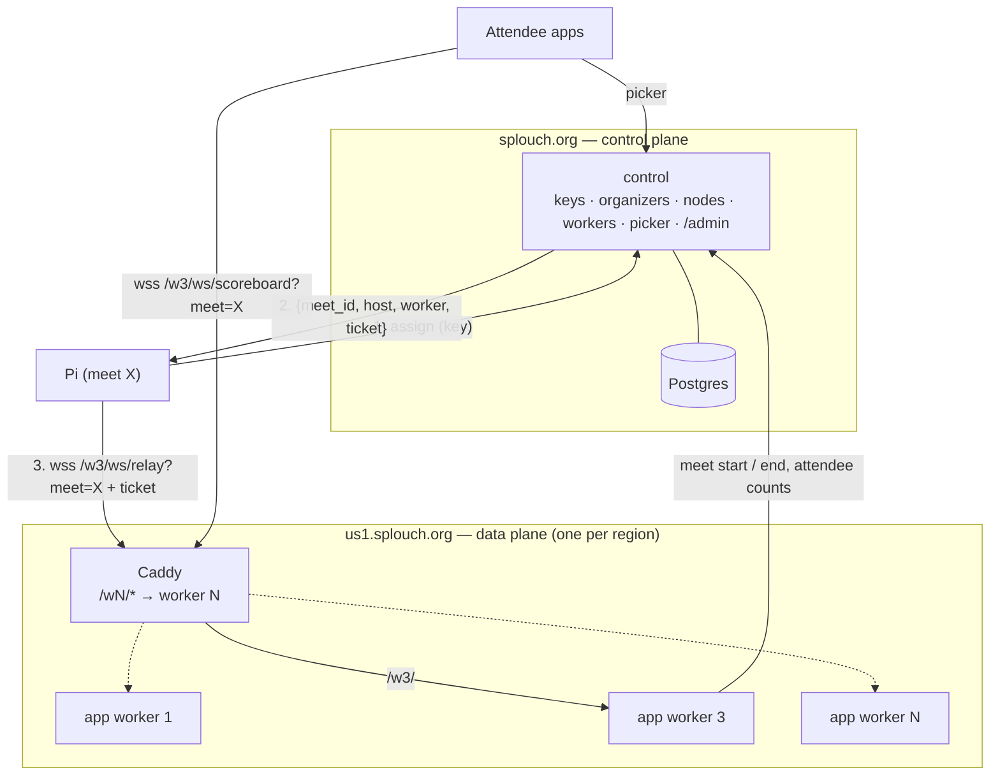
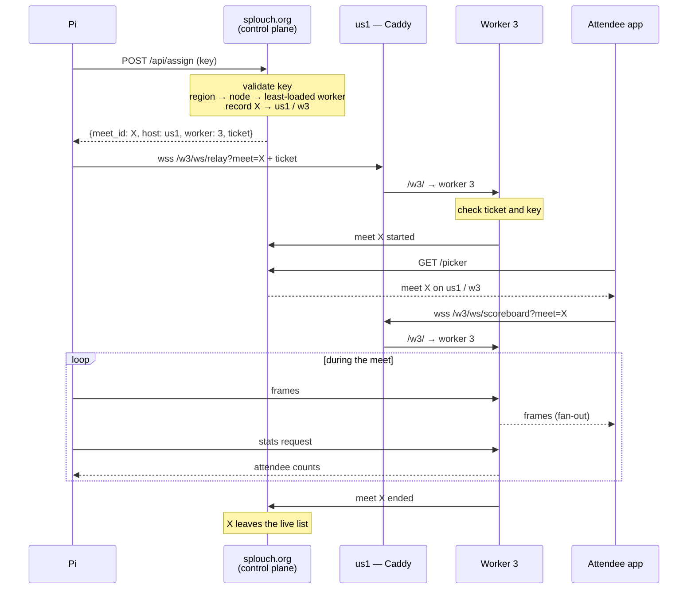
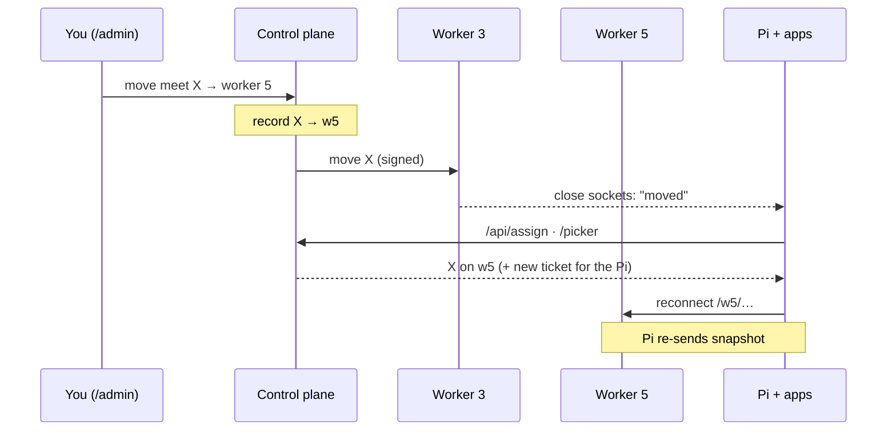
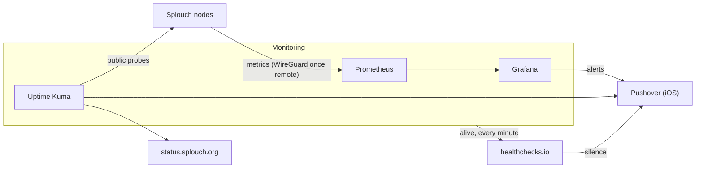

# Scaling the cloud relay

> **Partly built.** Stage 0 and the first batch of stage 2 are in: the relay is a
> control plane (`cloud/cloud_control.py`, Postgres) and a worker
> (`cloud/cloud_server.py`) on one box — see *Progress* at the end. The rest is the
> target architecture for serving clubs across Canada, the US and Europe, and the
> order to get there in.

---

## Load assumptions

- **Attendees are not connections.** A busy US weekend may have ~450,000 people at
  swim meets, but most watch the pool's board. At 10–20 % app adoption, the
  concurrent peak is in the order of **20–50k WebSockets**, spread over hundreds
  of meets.
- **Frames are small and rare.** The race clock is already throttled
  ([`cloud_server.py`](../../cloud/cloud_server.py), `_CLOCK_SYNC_SECS`); an
  attendee gets roughly one ~300-byte frame per second. 50k attendees ≈ 15 MB/s.
- **Latency is irrelevant.** A transatlantic round trip is ~100 ms. Regions exist
  for **data residency** (EU meets stay in the EU) and **fault isolation**, not
  speed.
- **Meets share nothing.** One writer (the Pi), N readers (attendees), no state
  across meets. That is what makes sharding by meet possible.

---

## Decisions

| Topic | Decision | Rejected |
| --- | --- | --- |
| Shape | Control plane + regional data plane | One big box; full mesh |
| Data plane | One large VPS per region, N worker containers | Many 1–2 vCPU nodes (too many boxes); Cloudflare Durable Objects (TypeScript rewrite); Redis pub/sub (extra service) |
| Worker routing | Control plane assigns each meet a worker; URL carries `/wN/`; live moves from `/admin` | Caddy hashing `?meet=` (no manual remap, load-blind) |
| Worker count | Automatic from `nproc`; `WORKERS=` overrides | Set by hand |
| Orchestration | Docker Compose | Kubernetes, OpenStack (ops cost for one maintainer) |
| First box | Control plane + monitoring + CA node on one VPS, built to split | Separate boxes from day one |
| Domain | `splouch.org` (control plane), `ca1.` / `us1.` / `eu1.splouch.org` (nodes); `splouch.ca` redirects | Users typing regional subdomains |
| Region | Per organizer, set in `/admin` at key creation; per-meet override | Operator choice on the Pi |
| Organizer location | Country + state/province, set by admin, correctable from the Pi | — |
| Images | One image `ghcr.io/olivierouellet/splouch-cloud`, built by CI, two commands | Two images (version drift); building on the node |
| Updates | Rolling update driven from `splouch.org/admin` | Portainer, Watchtower |
| Monitoring | Self-hosted: Prometheus + Grafana + Uptime Kuma | Grafana Cloud, Netdata, Zabbix |
| Alerts | Grafana alerting → Pushover (iOS); healthchecks.io watches the monitoring | Alertmanager |
| Metrics transport | WireGuard hub-and-spoke, once there is a second box | Tailscale; push via Alloy |

---

## Topology



**Control plane** decides who and where. Low traffic, one instance, the only
source of truth for keys, nodes, workers and the meet list.

**Data plane** carries frames. High traffic, one node per region, holds live
sockets and meet state in memory only.

### When the control plane is down

- Running meets keep streaming. Pis reconnect to their worker with the cached
  ticket; workers check keys against their cached copy.
- New meets cannot be assigned, and the picker is unavailable.
- **Apps never strand an attendee.** An app watching a meet stays on it, and
  hides "back to picker" behind a short notice ("Meet list unavailable") until the
  control plane answers again. The app caches each meet's host and worker for
  that.

If a node is down, that node's meets stop.

---

## Control plane

`cloud/cloud_control.py`, in the same image as the relay.

| Responsibility | Detail |
| --- | --- |
| Organizers | Name, key, country, state/province, region; created in `/admin` |
| Nodes | Region, host, state (active / draining), worker count, WireGuard public key — reported by each node |
| Assignment | `POST /api/assign` (key) → `{meet_id, host, worker, ticket}`; picks the least-loaded worker on a node in the organizer's region |
| Moves | `/admin` → move a live meet to another worker or node |
| Registry | Workers report meet start, end and attendee count |
| Picker | `GET /picker` lists live and retained meets across all nodes, each with its host and worker |
| Regions | Region → nodes list, served to Pis and `/admin` — never hard-coded in clients |
| Rollout | Drives node deploy webhooks (see *Updates*) |
| Storage | Postgres (keys, organizers, nodes, registry, admin login and settings, attendance counts); nightly `pg_dump` off the box |
| Pages | The picker, `/admin` (every tab), `/server`, `/servers`, `/add`, `/privacy`, `/.well-known/*` |

Nodes call the control plane's internal API (`/internal/*`, every call carrying
`NODE_SECRET`), never its database. A register goes through the control plane, which
checks the key and owns the meet id; each worker keeps its last answer per key and
meet on disk, so a Pi it has admitted before can reconnect while the control plane is
down.

### Regions and organizers

- **Region per organizer, nodes per region.** Organizers point at a region
  (`ca`, `us`, `eu`); the region lists its nodes (`us → us1, us2`). Adding `us2`
  or replacing a node never touches an organizer.
- **Draining.** A node marked draining gets no new meets; its running meets finish
  where they are, or are moved. This is how a node is upgraded or retired.
- **Location.** The admin sets country + state/province when creating the key and
  picks the region from it. The organizer can correct the location from the Pi's
  **Settings → Cloud**; the change is flagged in `/admin` and does **not** move the
  organizer's region on its own. Location also shows where clubs cluster, for
  balancing nodes.
- **Per-meet override.** Optional region on one meet, for a club travelling to
  another region. Blank by default.
- **Data residency.** EU organizers can only be in EU regions; the Pi cannot
  change its region.
- The Pi's Cloud tab shows the region read-only. The existing **Location** field
  stays as the venue name on the picker card.

---

## Data plane

One VPS per region, sized to the region (8–16 vCPU). Compose runs Caddy plus N
copies of the relay. A worker is one Python process: it uses at most one core.

### Worker count

Automatic. The deploy step computes `N = nproc − reserved` (one core for Caddy;
on the box that also hosts the control plane and monitoring, two or three) and
runs `docker compose up -d --scale app=N`. Resizing the VPS takes effect on the
next deploy. `WORKERS=` in `.env` overrides the computed value. The node reports
N to the control plane, which only assigns to workers that exist.

### Routing: explicit assignment

A worker keeps its meets' sockets in memory
([`cloud_bus.py`](../../cloud/cloud_bus.py)), so the Pi and every attendee of a
meet must reach the same worker. The control plane decides which one and puts it
in the URL. The deploy step generates the Caddyfile for N workers:

```caddy
us1.splouch.org {
    handle_path /w1/* {
        reverse_proxy splouch-app-1:5000
    }
    handle_path /w2/* {
        reverse_proxy splouch-app-2:5000
    }
    # … one block per worker
}
```

`handle_path` strips the prefix, so a worker still serves `/ws/relay`,
`/ws/scoreboard` and the rest unchanged. Container names are stable
(`<project>-app-<n>`, project pinned to `splouch`), so worker 3 restarts as
worker 3.

- **Load-aware.** New meets go to the worker with the fewest attendees, from the
  counts workers report.
- **Live move.** `/admin` → move meet X from worker 3 to worker 5 (or to another
  node). The control plane records the new assignment and tells worker 3, which
  closes meet X's sockets with a "moved" close code. The Pi and apps ask again
  (`/api/assign`, `/picker`) and reconnect to worker 5. The Pi re-sends its
  schedule and results snapshot on connect, so nothing is lost; attendees see a
  few seconds' blip.
- **Rescaling.** Lowering N removes workers; their meets are moved first, the same
  way. Avoid rescaling on a meet weekend.

### Security

- **Workers are never public.** Only Caddy reaches them; `/w3/` is a routing
  label, not an entry point.
- **Signed tickets for the relay.** `/api/assign` returns a ticket — meet, node,
  worker, expiry (one meet day) — signed with `NODE_SECRET`, known only to the
  control plane and the nodes. A worker accepts a relay only with a valid ticket
  for itself, **and** a valid key, as today. A stolen key cannot open a meet on a
  worker the control plane did not assign.
- **Attendees need no ticket** — the scoreboard is public. A worker that does not
  hold the requested meet refuses with a "not here" close code; the app asks the
  picker again.
- **Only the control plane moves meets.** The move call to a worker is signed with
  the same secret.
- **Floods.** Anyone can open sockets, as today. Per-IP connection limits in Caddy.

### Relay changes needed

1. **Worker and meet in the URL.** Attendee sockets connect to
   `/wN/ws/{scoreboard,results,schedule}?meet=<id>`; today the ID arrives in the
   first message ([`cloud_server.py`](../../cloud/cloud_server.py),
   `/ws/scoreboard`). HTTP routes already use `?meet=`.
2. **Pi assignment first.** The Pi calls `/api/assign`, caches
   `{meet_id, host, worker, ticket}`, then connects to
   `wss://<host>/w<N>/ws/relay?meet=<id>` with the ticket. On "moved" or "not here"
   it asks again. Today the meet ID is minted after the Pi connects.
3. **Serialize once.** *Done (stage 0).*
4. **Report to the control plane.** *Done:* register, schedule and disconnect, plus
   a heartbeat naming the meets a worker holds; a meet whose worker stops vouching
   for it is retired after 90 s.
5. **Keys from the control plane.** *Done:* a register is checked there, the answer
   cached per key and meet; `keys.json` is imported once (`cloud/cloud_import.py`).
6. **Tickets and moves.** Check the ticket on relay connect; accept a signed move
   call; close a meet's sockets with "moved".
7. **Attendee counts on the Pi stay.** The worker holding a meet answers the Pi's
   `stats` request on the relay socket, as today
   ([`cloud_server.py`](../../cloud/cloud_server.py), `stats`). *Done:* counts live
   in the control plane's Postgres; workers send joins in batches and ask for the
   numbers, so a meet's count stays whole across workers and nodes.
8. **`/metrics`** per worker (see *Monitoring*).

The **Server URL** field stays for clubs running their own relay: pointed at a
self-hosted server, the Pi connects directly and skips assignment.

### Client impact

Pis and apps store only `splouch.org`. The picker returns each meet's host and
worker; the apps open the socket there, and handle "moved" / "not here" by asking
the picker again. The `GET /servers` / picker contract in
[`docs/api.md`](../api.md) gains a per-meet host and worker, and the picker-down
rule above.

---

## Meet lifecycle



### Live move



---

## Images and updates

### One image, two commands

CI (GitHub Actions) builds `ghcr.io/olivierouellet/splouch-cloud:<tag>` on each
release tag. Every box pulls it; compose picks the role:

```yaml
name: splouch
services:
  control:      # control plane box (CA node at first)
    image: ghcr.io/olivierouellet/splouch-cloud:${SPLOUCH_VERSION}
    command: uvicorn cloud_control:app --host 0.0.0.0 --port 8000 --no-access-log
  app:          # every data-plane node
    image: ghcr.io/olivierouellet/splouch-cloud:${SPLOUCH_VERSION}
    command: uvicorn cloud_server:app --host 0.0.0.0 --port 5000 --no-access-log
```

One tag means the control plane and every node run the same code: the API between
them cannot drift, and shared code (keys, meet IDs, i18n) needs no package.

### Rolling update from `/admin`

1. Push a tag; CI pushes the image.
2. `splouch.org/admin` → **Update** lists tags and every node with its live meets.
3. The control plane updates itself, then each node in turn through its deploy
   webhook: check out the tag (compose and config), compute N, regenerate the
   Caddyfile, `docker compose pull`, `up -d`, health check.
4. A node with live meets waits, or its meets are moved first. A failed health
   check stops the rollout; roll that node back to the previous tag.

No Portainer (a second, drifting way to change stacks, with root over Docker). No
Watchtower (it would restart workers mid-meet). The OS keeps unattended security
upgrades. Releases go out on weekdays.

---

## Migration path

Each stage only when monitoring says the previous one is full.

| Stage | Boxes | What changes |
| --- | --- | --- |
| 0 — now | 1 | Serialize once; load-test one worker (k6 / locust replaying a recording) to get real capacity |
| 1 — bigger box | 1 | Resize the VPS; `/metrics` |
| 2 — split roles on one box | 1 (CA) | `control` + Postgres + `app ×N` + monitoring stack on the CA node; `splouch.org` and `ca1.splouch.org` both point at it; assignment, tickets, `/wN/` routing; GHCR images |
| 3 — regions | 3 | Add `us1`, `eu1`; organizers get regions; WireGuard from the CA node to the new nodes; rolling updates across nodes |
| 4 — split out | 4–5 | Monitoring to its own VPS (other provider); control plane to a small VPS: restore the dump, move `splouch.org`'s A record. No Pi or app change |
| 5 — more nodes | as needed | Add `us2` to the region list; new meets go to the least-loaded worker across both |

What keeps stage 4 cheap is set up in stage 2:

- `control`, `app` and the monitoring stack are separate compose projects or
  services, sharing nothing but the machine.
- Workers reach the control plane only through `https://splouch.org/api/…`.
- Clients only ever see regional hosts inside control-plane answers.

---

## Monitoring



| Piece | Answers |
| --- | --- |
| Prometheus + Grafana | Is something wrong **inside** the nodes? |
| Uptime Kuma | Can users **reach** Splouch? DNS, TLS, cert expiry, HTTP; public status page |
| healthchecks.io | Is the **monitoring** alive? |

### Where it runs

- **Stages 2–3: on the CA node**, as its own compose project. Prometheus scrapes
  the local workers over the Docker network — no tunnel. The catch: if the box
  dies, its monitoring dies with it. healthchecks.io is the safety net — its pings
  stop and it pages. Kuma probing its own box adds little until it moves.
- **Stage 4: its own small VPS** (2 vCPU, 4 GB, 40–80 GB disk), at a different
  provider or datacenter. Kuma then watches every box from outside.

### Metrics

| Layer | Source | Watch |
| --- | --- | --- |
| Host | node_exporter | CPU per core, RAM, network, disk |
| Containers | cAdvisor | CPU and RAM per worker, `control`, Postgres, Caddy |
| App | `/metrics` per worker (`prometheus_client`) | Meets, attendees, frames/s, **event-loop lag** |

Watch **per worker**, not per core: a worker is one process on at most one core,
and saturates while the box looks idle. Event-loop lag (a 1 s timer, how late it
fires) is the earliest saturation signal — and the cue to move a meet off a busy
worker.

Metrics are counts only — no IPs, no client-supplied names — in line with
the `/privacy` page and the relay's no-access-log rule.

### Alerts (Grafana → Pushover)

| Alert | Threshold |
| --- | --- |
| Worker CPU | > 70 % for 5 min |
| Event-loop lag | > 100 ms for 2 min |
| Scrape target down | 2 min (tunnel or node) |
| Disk | > 80 % |
| Watchdog | Always firing → healthchecks.io; silence = monitoring down |

Kuma pages separately on public checks, a TLS certificate under 14 days, and a
missed backup heartbeat (`pg_dump` pings a Kuma push monitor). Pushover emergency
priority repeats until acknowledged.

Grafana data sources, dashboards (JSON), alert rules and contact points are
**provisioned from files in git**. Provisioned items are read-only in the UI: edit,
export, commit. Secrets (Pushover token) live in `.env`.

### WireGuard

Needed from the first remote box (stage 3) on.

- **Hub-and-spoke.** The box running Prometheus is the hub; each node has one
  peer. Nodes never talk to each other over the tunnel.
- **Keys.** Each box generates its own private key in `/etc/wireguard` (root only,
  never in git). Only public keys are exchanged — they are not secret.
- **Where to find a public key.** `install.sh cloud` prints it at install. The
  node's deploy webhook (on the host) also reports it, so `/admin` → **Nodes**
  shows each node's public key and the hub's peer block, ready to copy. On the box
  itself: `sudo wg show wg0 public-key`.
- **Scope.** Only monitoring uses the tunnel. Pis, attendees and control-plane ↔
  node calls go over public HTTPS. A broken tunnel blinds Prometheus; Kuma, still
  probing publicly, tells whether Splouch is up. Production traffic must never be
  routed through WireGuard.
- UDP 51820 open on the hub only. When monitoring moves to its own VPS (stage 4),
  the hub moves with it: one new peer block per node.

The monitoring stack is its own compose project in the repo, updated through the
same webhook. It builds nothing: upstream images, pinned versions.

---

## Open questions

- Real per-worker capacity — the stage 0 load test decides worker counts and
  how many cores to reserve.
- Whether the US needs a second node (`us2`) or one large box carries it.
- Picker caching: Cloudflare (or similar) in front of `splouch.org` for the picker
  JSON, static files and retained results.
- Retained meets: which node serves a finished meet's results, and for how long,
  once meets live on several nodes.
- Picker and apps with several workers: the picker must hand out each meet's host
  and worker (batch 4) before a second worker is turned on.

---

## Progress

| Batch | State |
| --- | --- |
| Stage 0 — encode once, load test | Done (`tests/relay_load.py`) |
| 1 — control plane | Done. Control plane and worker split; Postgres store (organizers with country, state/province and region; meets; admin login and settings; counts); every admin tab and the picker on the control plane; internal API; worker heartbeat; import of a pre-split data directory. One box: Caddy sends a meet's live paths to the worker and everything else to the control plane |
| 2 — assignment and tickets | Next |
| 3 — several workers, `/wN/` routing, live moves | — |
| 4 — picker hands out host and worker; app contract | — |
| 5 — GHCR images, rolling update | — |
| 6 — monitoring | — |
| 7 — installer roles, WireGuard | — |
