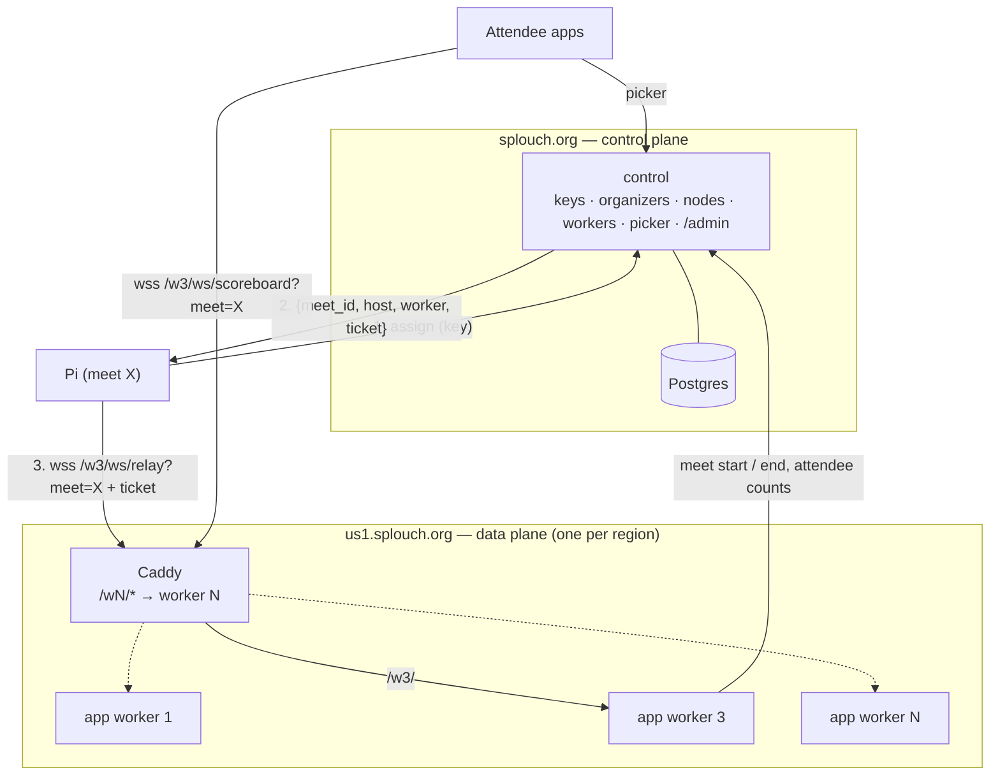
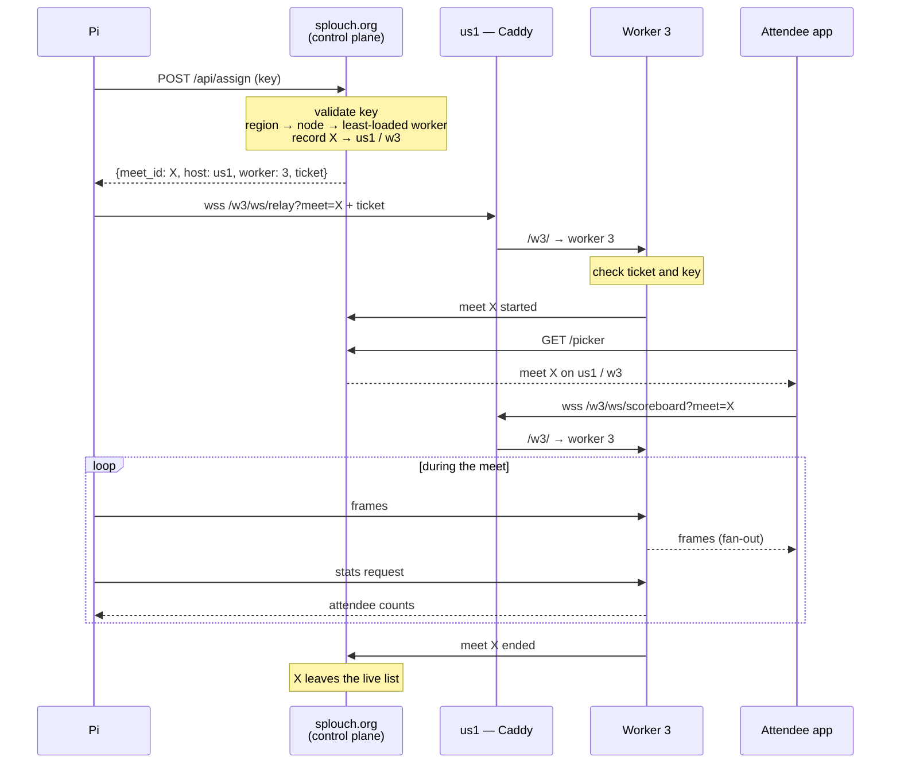
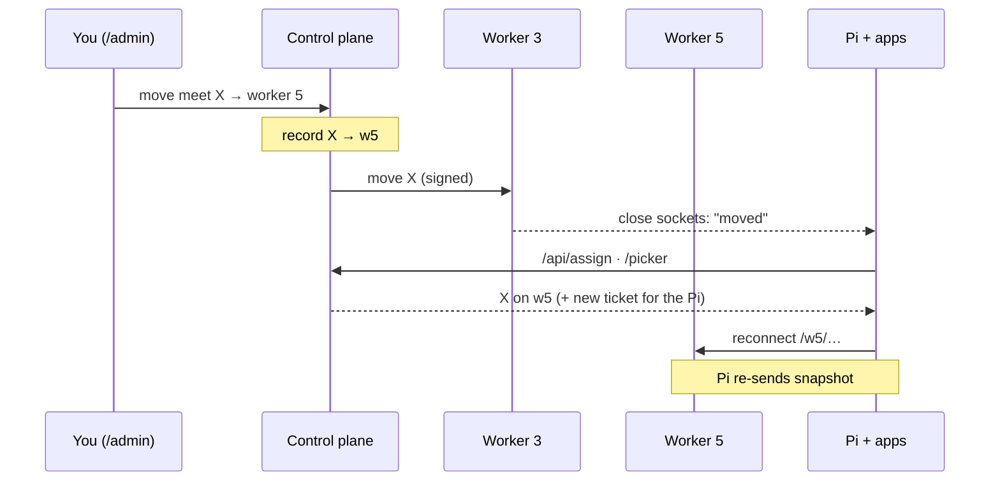
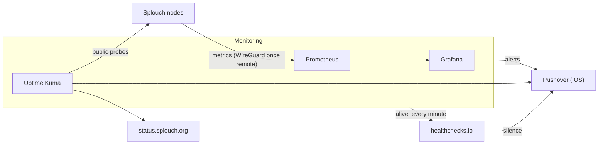

# Scaling the cloud relay

> **Partly built.** Stage 0 and the first batch of stage 2 are in: the relay is a
> control plane (`cloud/cloud_control.py`, Postgres) and a worker
> (`cloud/cloud_server.py`) on one box — see *Progress* at the end. The rest is the
> target architecture for serving clubs across Canada, the US and Europe, and the
> order to get there in.

---

## Load assumptions

- **Attendees are not connections.** A busy US weekend may have ~450,000 people at
  swim meets, but most watch the pool's board. At 10–20 % app adoption, the
  concurrent peak is in the order of **20–50k WebSockets**, spread over hundreds
  of meets.
- **Frames are small and rare.** The race clock is already throttled
  ([`cloud_server.py`](../../cloud/cloud_server.py), `_CLOCK_SYNC_SECS`); an
  attendee gets roughly one ~300-byte frame per second. 50k attendees ≈ 15 MB/s.
- **Latency is irrelevant.** A transatlantic round trip is ~100 ms. Regions exist
  for **data residency** (EU meets stay in the EU) and **fault isolation**, not
  speed.
- **Meets share nothing.** One writer (the Pi), N readers (attendees), no state
  across meets. That is what makes sharding by meet possible.

---

## Decisions

| Topic | Decision | Rejected |
| --- | --- | --- |
| Shape | Control plane + regional data plane | One big box; full mesh |
| Data plane | One large VPS per region, N worker containers | Many 1–2 vCPU nodes (too many boxes); Cloudflare Durable Objects (TypeScript rewrite); Redis pub/sub (extra service) |
| Worker routing | Control plane assigns each meet a worker; URL carries `/wN/`; live moves from `/admin` | Caddy hashing `?meet=` (no manual remap, load-blind) |
| Worker count | Automatic from `nproc`; `WORKERS=` overrides | Set by hand |
| Orchestration | Docker Compose | Kubernetes, OpenStack (ops cost for one maintainer) |
| First box | Control plane + monitoring + CA node on one VPS, built to split | Separate boxes from day one |
| Domain | `splouch.org` (control plane), `ca1.` / `us1.` / `eu1.splouch.org` (nodes); `splouch.ca` redirects | Users typing regional subdomains |
| Region | Per organizer, set in `/admin` at key creation; per-meet override | Operator choice on the Pi |
| Organizer location | Country + state/province, set by admin, correctable from the Pi | — |
| Images | One image `ghcr.io/olivierouellet/splouch-cloud`, built by CI, two commands | Two images (version drift); building on the node |
| Updates | Rolling update driven from `splouch.org/admin` | Portainer, Watchtower |
| Monitoring | Self-hosted: Prometheus + Grafana + Uptime Kuma | Grafana Cloud, Netdata, Zabbix |
| Alerts | Grafana alerting → Pushover (iOS); healthchecks.io watches the monitoring | Alertmanager |
| Metrics transport | WireGuard hub-and-spoke, once there is a second box | Tailscale; push via Alloy |

---

## Topology



**Control plane** decides who and where. Low traffic, one instance, the only
source of truth for keys, nodes, workers and the meet list.

**Data plane** carries frames. High traffic, one node per region, holds live
sockets and meet state in memory only.

### When the control plane is down

- Running meets keep streaming. Pis reconnect to their worker with the cached
  ticket; workers check keys against their cached copy.
- New meets cannot be assigned, and the picker is unavailable.
- **Apps never strand an attendee.** An app watching a meet stays on it, and
  hides "back to picker" behind a short notice ("Meet list unavailable") until the
  control plane answers again. The app caches each meet's host and worker for
  that.

If a node is down, that node's meets stop.

---

## Control plane

`cloud/cloud_control.py`, in the same image as the relay.

| Responsibility | Detail |
| --- | --- |
| Organizers | Name, key, country, state/province, region; created in `/admin` |
| Nodes | Region, host, state (active / draining), worker count, WireGuard public key — reported by each node |
| Assignment | `POST /api/assign` (key) → `{meet_id, host, worker, ticket}`; picks the least-loaded worker on a node in the organizer's region |
| Moves | `/admin` → move a live meet to another worker or node |
| Registry | Workers report meet start, end and attendee count |
| Picker | `GET /picker` lists live and retained meets across all nodes, each with its host and worker |
| Regions | Region → nodes list, served to Pis and `/admin` — never hard-coded in clients |
| Rollout | Drives node deploy webhooks (see *Updates*) |
| Storage | Postgres (keys, organizers, nodes, registry, admin login and settings, attendance **totals**); nightly `pg_dump` off the box. Visitor ids never: they stay on the node (*Attendance*) |
| Pages | The picker, `/admin` (every tab), `/server`, `/servers`, `/add`, `/privacy`, `/.well-known/*` |

Nodes call the control plane's internal API (`/internal/*`, every call carrying
`NODE_SECRET`), never its database. A register goes through the control plane, which
checks the key and owns the meet id; each worker keeps its last answer per key and
meet on disk, so a Pi it has admitted before can reconnect while the control plane is
down.

### Regions and organizers

- **Region per organizer, nodes per region.** Organizers point at a region
  (`ca`, `us`, `eu`); the region lists its nodes (`us → us1, us2`). Adding `us2`
  or replacing a node never touches an organizer.
- **Draining.** A node marked draining gets no new meets; its running meets finish
  where they are, or are moved. This is how a node is upgraded or retired.
- **Location.** The admin sets country + state/province when creating the key and
  picks the region from it. The organizer can correct the location from the Pi's
  **Settings → Cloud**; the change is flagged in `/admin` and does **not** move the
  organizer's region on its own. Location also shows where clubs cluster, for
  balancing nodes.
- **Per-meet override.** Optional region on one meet, for a club travelling to
  another region. Blank by default.
- **Data residency.** EU organizers can only be in EU regions; the Pi cannot
  change its region.
- The Pi's Cloud tab shows the region read-only. The existing **Location** field
  stays as the venue name on the picker card.

---

## Data plane

One VPS per region, sized to the region (8–16 vCPU). Compose runs Caddy plus N
copies of the relay. A worker is one Python process: it uses at most one core.

### Worker count

Automatic. On every deploy [`cloud_workers.py`](../../cloud/cloud_workers.py)
computes `N = cores − RESERVED_CORES` (default 2: Caddy, the control plane and
Postgres share them on a box that runs everything; 1 on a worker-only node), or
takes `WORKERS=` from `.env`. It writes two untracked files:

- `docker-compose.workers.yml` — `app2` … `appN`, each extending `app` with its own
  `WORKER` number (`app` is worker 1). A number per container, rather than
  `--scale`, is what lets a worker know which one it is.
- `caddy.d/workers.caddy` — one `/wN/*` route per worker, imported by the Caddyfile.

and names both compose files in `.env` (`COMPOSE_FILE`). The webhook then runs
`up -d --remove-orphans` and **reloads** Caddy — a reload keeps open sockets. A
resized VPS takes effect on the next deploy. Every worker reports N, and the control
plane only assigns to workers that exist.

### Routing: explicit assignment

A worker keeps its meets' sockets in memory
([`cloud_bus.py`](../../cloud/cloud_bus.py)), so the Pi and every attendee of a
meet must reach the same worker. The control plane decides which one and puts it
in the URL:

```caddy
splouch.org {
    import caddy.d/*.caddy          # handle_path /wN/* → appN:5000, one per worker
    @worker path /ws/* /mobile /mobile/* /meet/* /manifest/* /icon/*
    handle @worker {
        reverse_proxy app:5000      # unprefixed: worker 1
    }
    handle /internal/* {
        respond 404
    }
    handle {
        reverse_proxy control:8000
    }
}
```

`handle_path` strips the prefix, so a worker still serves `/ws/relay`,
`/ws/scoreboard` and the rest unchanged. A worker renders its pages with its own
prefix (`wbase`: iframes, sockets, manifest), so everything a page loads comes back
to the same worker; the Pi renders the same templates with none.

- **Load-aware.** New meets go to the worker with the fewest attendees, from the
  counts workers report.
- **Links.** The picker links a live meet to `<node>/wN/mobile`, and a retained
  one to `/mobile` — any worker serves a retained meet from its record. A page
  or socket for a meet live on another worker redirects there (`moved` on a socket).
- **Live move.** `/admin` → **Move** on a live meet. The control plane points the
  meet at the target at once — so the Pi's next `/api/assign` lands there and the
  old worker's disconnect cannot retire it — and the old worker learns from its
  next heartbeat reply (≤ 10 s). It sends its attendees `moved {url}` (web pages
  follow it; apps in batch 4), tells the Pi `rejected {reassign: true}` and closes
  it. The Pi re-sends its schedule, board and results on connect, so nothing is
  lost; attendees see a few seconds' blip. The new worker's heartbeat leaves the
  meet alone for 30 s while the Pi arrives. No call ever goes *to* a worker.
- **Rescaling.** Lowering N removes workers; move their meets first. A Pi whose
  worker is gone asks `/api/assign` again after three failed connects. Avoid
  rescaling on a meet weekend.
- **Draining.** `/admin` → **Nodes** → **Drain**: the node takes no new meets, and
  the ones it carries finish there or are moved.

### Security

- **Workers are never public.** Only Caddy reaches them; `/w3/` is a routing
  label, not an entry point.
- **Signed tickets for the relay.** `/api/assign` returns a ticket — meet, node,
  worker, expiry (one meet day) — signed with `NODE_SECRET`, known only to the
  control plane and the nodes. A worker accepts a relay only with a valid ticket
  for itself, **and** a valid key, as today. A stolen key cannot open a meet on a
  worker the control plane did not assign.
- **Attendees need no ticket** — the scoreboard is public. A worker that does not
  hold the requested meet refuses with a "not here" close code; the app asks the
  picker again.
- **Only the control plane moves meets.** A move is an answer to a worker's own
  heartbeat, which carries `NODE_SECRET`; nothing calls in to a worker.
- **Floods.** Anyone can open sockets, as today. Per-IP connection limits in Caddy.

### Relay changes needed

1. **Worker in the URL.** *Done:* sockets and pages go to `/wN/…`, which is all
   Caddy routes on; the meet stays in the first message (`join_meet`), as before.
2. **Pi assignment first.** *Done:* the Pi calls `/api/assign`, keeps
   `{meet_id, relay_url, ticket, region}`, and connects to the `relay_url` the control
   plane built (so adding `/wN/` needs no Pi change). On `rejected {reassign: true}`,
   a new meet, key or server, or three failed connects, it asks again.
3. **Serialize once.** *Done (stage 0).*
4. **Report to the control plane.** *Done:* register, schedule and disconnect, plus
   a heartbeat naming the meets a worker holds; a meet whose worker stops vouching
   for it is retired after 90 s.
5. **Keys from the control plane.** *Done:* a register is checked there, the answer
   cached per key and meet; `keys.json` is imported once (`cloud/cloud_import.py`).
6. **Tickets and moves.** *Tickets done:* a worker refuses a register without a
   valid ticket for itself, the key and the meet, and admits one on the ticket alone
   while the control plane is down (this replaced batch 1's register cache). Moves
   are batch 3.
7. **Attendee counts on the Pi stay.** The worker holding a meet answers the Pi's
   `stats` request on the relay socket, as today
   ([`cloud_server.py`](../../cloud/cloud_server.py), `stats`). *Done:* from the
   node's own store, so it answers while the control plane is down (*Attendance*).
8. **`/metrics`** per worker (see *Monitoring*).

The **Server URL** field stays for clubs running their own relay: pointed at a
self-hosted server, the Pi connects directly and skips assignment.

### Attendance

Visitor ids stay in the region of the meet. Each node keeps its meets' joins in one
SQLite file on its data volume (`cloud_attendance`, WAL so its workers all write),
counts distinct visitors per window there, prunes them after the retention
`/privacy` states, and answers the Pi's Cloud tab from it. Worker 1 sends the
node's **numbers** with every third heartbeat — `{meet: {1h, 3h, 12h, 24h, 7d,
all}}` for each meet with a visitor in the last 7 days, so a finished meet's
"last hour" still falls — and the control plane keeps them for `/admin`. No id
crosses a border. A meet moved across nodes adds both nodes' numbers: a phone that
saw it on both counts twice, the one approximation.

### Client impact

Pis and apps store only `splouch.org`. The picker returns each meet's host and
worker; the apps open the socket there, and handle "moved" / "not here" by asking
the picker again. The `GET /servers` / picker contract in
[`docs/api.md`](../api.md) gains a per-meet host and worker, and the picker-down
rule above.

---

## Meet lifecycle



### Live move



---

## Images and updates

### One image, two commands

CI ([`image.yml`](../../.github/workflows/image.yml)) builds
`ghcr.io/olivierouellet/splouch-cloud` for every release tag and for `master`,
natively on an x86 and an Arm runner, joined under one tag. Every box pulls the tag
it deploys; compose picks the role:

```yaml
services:
  control:
    image: ${SPLOUCH_IMAGE:-ghcr.io/olivierouellet/splouch-cloud}:${SPLOUCH_VERSION:-master}
    command: ["uvicorn", "cloud_control:app", …]
  app:          # every worker (app2… extend it)
    image: …same…
```

One tag means the control plane and every node run the same code: the API between
them cannot drift, and shared code (keys, meet IDs, i18n) needs no package. The
package is public on GHCR, so a box pulls it with no login.

[`cloud_deploy.py`](../../cloud/cloud_deploy.py) is the last step of every deploy —
the webhook's and the installer's: size the worker set, record `SPLOUCH_VERSION`,
pull, start with `--remove-orphans`, reload Caddy. A version with no image (a
branch, a fork, a tag whose build is still running) is built on the box instead
(`docker-compose.build.yml`).

### Rolling update from `/admin`

Pulled, never pushed — nothing calls in to a node:

1. Push a tag; CI publishes the image.
2. `/admin` → **Update & Backup** → **Roll out to every node** with that version
   (a release tag or `master`; never "latest", which each node would resolve on its
   own, or a branch, which has no image).
3. **When:** now, or at a set time — the panel offers 2:00 the next night, in the
   admin's own clock. The control plane then releases one node at a time, by name,
   each only while **no meet is in progress on it**. A meet is in progress while its
   console sent a board frame in the last 2 hours, or on one of its session days at
   the pool (the Pi sends its session dates and its UTC offset). A Pi plugged in a
   week ahead, to publish its schedule, is connected but not in progress, and holds
   nothing back. **Force** releases nodes regardless; drain a node or move its meets
   to free it otherwise. A released node learns its target from its next heartbeat
   reply; its worker 1 calls the node's own deploy webhook, which deploys that
   version.
4. The node is done when its heartbeat reports the version (`SPLOUCH_VERSION`), and
   the next one is released. A node not back on it within 15 minutes stops the
   rollout and the panel names it; roll back by rolling out the previous version.
   A node not reporting at all is skipped. The panel shows the state; the **Nodes**
   tab each node's version and target.

The box running the control plane is a node like the others: its update restarts
the control plane too, and the rollout, kept in Postgres, carries on.

No Portainer (a second, drifting way to change stacks, with root over Docker). No
Watchtower (it would restart workers mid-meet). The OS keeps unattended security
upgrades. Releases go out on weekdays.

---

## Migration path

Each stage only when monitoring says the previous one is full.

| Stage | Boxes | What changes |
| --- | --- | --- |
| 0 — now | 1 | Serialize once; load-test one worker (k6 / locust replaying a recording) to get real capacity |
| 1 — bigger box | 1 | Resize the VPS; `/metrics` |
| 2 — split roles on one box | 1 (CA) | `control` + Postgres + `app ×N` + monitoring stack on the CA node; `splouch.org` and `ca1.splouch.org` both point at it; assignment, tickets, `/wN/` routing; GHCR images |
| 3 — regions | 3 | Add `us1`, `eu1`; organizers get regions; WireGuard from the CA node to the new nodes; rolling updates across nodes |
| 4 — split out | 4–5 | Monitoring to its own VPS (other provider); control plane to a small VPS: restore the dump, move `splouch.org`'s A record. No Pi or app change |
| 5 — more nodes | as needed | Add `us2` to the region list; new meets go to the least-loaded worker across both |

What keeps stage 4 cheap is set up in stage 2:

- `control`, `app` and the monitoring stack are separate compose projects or
  services, sharing nothing but the machine.
- Workers reach the control plane only through `https://splouch.org/api/…`.
- Clients only ever see regional hosts inside control-plane answers.

---

## Monitoring



| Piece | Answers |
| --- | --- |
| Prometheus + Grafana | Is something wrong **inside** the nodes? |
| Uptime Kuma | Can users **reach** Splouch? DNS, TLS, cert expiry, HTTP; public status page |
| healthchecks.io | Is the **monitoring** alive? |

### Where it runs

- **Stages 2–3: on the CA node**, as its own compose project. Prometheus scrapes
  the local workers over the Docker network — no tunnel. The catch: if the box
  dies, its monitoring dies with it. healthchecks.io is the safety net — its pings
  stop and it pages. Kuma probing its own box adds little until it moves.
- **Stage 4: its own small VPS** (2 vCPU, 4 GB, 40–80 GB disk), at a different
  provider or datacenter. Kuma then watches every box from outside.

### Metrics

| Layer | Source | Watch |
| --- | --- | --- |
| Host | node_exporter | CPU per core, RAM, network, disk |
| Containers | cAdvisor | CPU and RAM per worker, `control`, Postgres, Caddy |
| App | `/metrics` per worker (`prometheus_client`) | Meets, attendees, frames/s, **event-loop lag** |

Watch **per worker**, not per core: a worker is one process on at most one core,
and saturates while the box looks idle. Event-loop lag (a 1 s timer, how late it
fires) is the earliest saturation signal — and the cue to move a meet off a busy
worker.

Metrics are counts only — no IPs, no client-supplied names — in line with
the `/privacy` page and the relay's no-access-log rule.

### Alerts (Grafana → Pushover)

| Alert | Threshold |
| --- | --- |
| Worker CPU | > 70 % for 5 min |
| Event-loop lag | > 100 ms for 2 min |
| Scrape target down | 2 min (tunnel or node) |
| Disk | > 80 % |
| Watchdog | Always firing → healthchecks.io; silence = monitoring down |

Kuma pages separately on public checks, a TLS certificate under 14 days, and a
missed backup heartbeat (`pg_dump` pings a Kuma push monitor). Pushover emergency
priority repeats until acknowledged.

Grafana data sources, dashboards (JSON), alert rules and contact points are
**provisioned from files in git**. Provisioned items are read-only in the UI: edit,
export, commit. Secrets (Pushover token) live in `.env`.

### WireGuard

Needed from the first remote box (stage 3) on ([`wireguard.sh`](../../install/scripts/wireguard.sh)).

- **Hub-and-spoke.** The box running monitoring is the hub, `10.73.0.1`; each node
  has one peer, the hub. Nodes never talk to each other over the tunnel.
- **Nodes push.** A node runs a small Prometheus in agent mode
  ([`agent.yml`](../../cloud/monitoring/agent.yml)) that scrapes its own workers — it
  knows their exact number — its host and containers, and sends to the hub's
  Prometheus over the tunnel. Nothing listens on a node; the hub listens on its
  WireGuard address only. (Chosen over the hub pulling, which would have had every
  node publish its exporters and workers, and the hub track each node's worker
  count.)
- **Keys.** Each box generates its own private key in `/etc/wireguard` (root only,
  never in git, never printed). Only public keys are exchanged — they are not
  secret.
- **Where to find a public key.** The installer prints it. A node's workers also
  report it (`/etc/splouch/wg-public.key`), so `/admin` → **Nodes** shows it. On the
  box itself: `sudo wg show wg0 public-key`.
- **Scope.** Only monitoring uses the tunnel. Pis, attendees and control-plane ↔
  node calls go over public HTTPS. A broken tunnel blinds Prometheus; Kuma, still
  probing publicly, tells whether Splouch is up. Production traffic must never be
  routed through WireGuard.
- UDP 51820 open on the hub only. When monitoring moves to its own VPS (stage 4),
  the hub moves with it: one `add-peer` per node.

The monitoring stack is its own compose project in the repo, updated through the
same webhook. It builds nothing: upstream images, pinned versions.

---

## Open questions

- Real per-worker capacity — the stage 0 load test decides worker counts and
  how many cores to reserve.
- Whether the US needs a second node (`us2`) or one large box carries it.
- Picker caching: Cloudflare (or similar) in front of `splouch.org` for the picker
  JSON, static files and retained results.
- Retained meets: which node serves a finished meet's results, and for how long,
  once meets live on several nodes.
- Picker and apps with several workers: the picker must hand out each meet's host
  and worker (batch 4) before a second worker is turned on.

---

## Progress

| Batch | State |
| --- | --- |
| Stage 0 — encode once, load test | Done (`tests/relay_load.py`) |
| 1 — control plane | Done. Control plane and worker split; Postgres store (organizers with country, state/province and region; meets; admin login and settings; counts); every admin tab and the picker on the control plane; internal API; worker heartbeat; import of a pre-split data directory. One box: Caddy sends a meet's live paths to the worker and everything else to the control plane |
| 2 — assignment and tickets | Done. `POST /api/assign` (least-loaded worker on a live node in the organizer's region; a meet goes back to the worker that held it), signed tickets checked by the worker, attendee counts in the heartbeat. The Pi asks before connecting and reports its country and state/province, which `/admin` flags beside the record with **Accept**; the region shows read-only on the Pi |
| 3 — several workers, `/wN/` routing, live moves | Done. Worker set from the core count (`cloud_workers.py`: compose override, Caddy routes, graceful reload); `/wN/` in relay URLs, picker links and every page a worker serves; redirects and `moved` for a meet live elsewhere; live moves through the heartbeat; **Nodes** tab (state, drain, WireGuard key, forget) |
| 4 — picker hands out host and worker; app contract | Done (server and web). `app.md` v3: `C-11` (meet's `base` from `GET /meets`), `C-12` (`moved {url, base}`), `A-12` (meet list unreachable → stay), `P-18` (compact rows above 10 meets, no images), `P-01`/`P-17` (organizer's province and country shown and searched), `A-09` (asked of the meet's base). iOS and Android still to build these |
| 4b — attendance in the region | Done. Visitor ids on the node (SQLite, the old `analytics.db`), numbers only to the control plane, Pi answered locally; `C-10` one id per server, web hands it over in the URL fragment; `/privacy` says where ids are kept |
| 5 — GHCR images, rolling update | Done. CI image per release tag and `master` (amd64 + arm64); `cloud_deploy.py` pulls it, or builds when there is none; pull-based rolling update — the control plane releases one free node at a time, the node's worker 1 calls its own webhook, done when its heartbeat reports the version, 15-minute failure stop; versions in the **Nodes** tab |
| 6 — monitoring | Done. Counts-only `/metrics` on workers and the control plane (sockets, meets, frames, event-loop lag; private network only); `cloud/monitoring/` — Prometheus (worker targets written per deploy), Grafana provisioned from git (dashboard, five alerts to Pushover, emergency priority), Uptime Kuma (loopback until set up, optional status domain), node_exporter, cAdvisor, healthchecks.io watchdog; on with `MONITORING=1`. The nightly `pg_dump` and its Kuma heartbeat are still to come |
| 7 — installer roles, WireGuard, backups | Done. Parts per server (`ROLES`: control, workers, monitoring, any combination; compose profiles; Caddy routes generated per part — a workers-only node redirects to the meet list, `/internal/*` public only with `REMOTE_NODES=1`); WireGuard hub-and-spoke (`install/scripts/wireguard.sh`) with node agents pushing metrics to the hub; nightly `pg_dump` with a heartbeat URL; `cloud_backup.py` dump/restore, which is also how the control plane moves |
