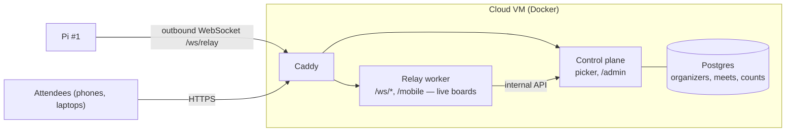
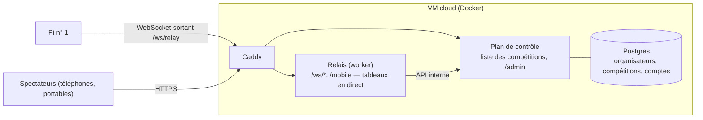

<p><a href="#cloud-relay">English</a> · <a href="#cloud-relay-fr">Français</a></p>

# Cloud Relay

The cloud relay lets remote attendees (parents, coaches, officials) follow the scoreboard from their phones over the internet, without adding load to the pool-deck Pi.



The relay is two apps on one VM: a **worker** that carries a meet's live frames, and a
**control plane** that owns the picker, the admin panel and the store
([`docs/architecture/scaling.md`](architecture/scaling.md)).

- Pi #1 opens a single outbound connection — works behind double-NAT with no port forwarding required.
- The cloud server re-emits events to all attendees; Pi #1 is unaffected by attendee load.
- Only scoreboard, results, and schedule data is exposed — meet files (`.lxf`, `.csv`) are never sent.
- Multiple organizers can share one cloud server simultaneously, each with their own revocable key.
- Caddy handles HTTPS and auto-renews Let's Encrypt certificates — no manual certificate management.

---

## Deploying the cloud server

**Requirements:**

- A Debian 12+ or Ubuntu 24.04+ VM, any cloud provider. The relay runs in Docker
  on its own Python 3.13, so the OS mostly doesn't matter; the deploy webhook runs
  on the VM's `python3` and needs 3.11 or newer. The installer checks this before
  it changes anything, and stops on Ubuntu 22.04 (Python 3.10).
- Ports 80 and 443 open in the VM's firewall / security group
- A domain name with an `A` record pointing at the VM's public IP

SSH into the VM and run:

```bash
curl -fsSL https://raw.githubusercontent.com/olivierouellet/Splouch/master/install/setup.sh -o setup.sh && bash setup.sh cloud
```

The script handles everything interactively:

- Asks which version to install — master, one of the 10 latest releases, or one you type — and runs that version's own installer
- Installs Docker, fail2ban, and unattended security upgrades
- Clones the repo and generates a `SECRET_KEY`, a `POSTGRES_PASSWORD` and a `NODE_SECRET`
- Prompts for admin username and password
- Prompts for your domain name and updates `Caddyfile`
- Generates a `DEPLOY_SECRET` and installs the deploy webhook as a systemd service
- Configures `ufw` (ports 22, 80, 443 TCP + 443 UDP for HTTP/3)
- Builds and starts the compose stack (control plane + Postgres + relay worker + Caddy)

When it finishes, open `https://yourdomain/admin` and add organizers.

---

## Managing organizers

The `/admin` page (HTTP basic auth — the login you chose at install; change it from the user
menu → **Change password**) lets you, under **Organizers** and **Active Meets**:

- **Add an organizer** — enter an organization name, and where it is based: country, state/province, and the **region** whose servers carry its meets (suggested from the country). A cryptographically random 32-byte key is generated automatically.
- **Edit a location** — under the organizer's name. When the organizer's Pi reports a different country or state/province, the row shows *Their Pi says: …* with **Accept**; accepting copies it, and the region stays yours to change.
- **Revoke a key** — the Pi with that key will be disconnected and refused on next connect.
- **Delete a key** — removes it from the list entirely.
- **View active meets** — shows every Pi currently connected with its meet name, location, sport, organizer, console, and connection time.

The **Console** column is the console key the Pi reports (`cts_gen6`, `manual`, a plugin's
own key), so a support question — *which console was that meet running on?* — is answered
without phoning the operator. A meet whose console produces no times at all is marked
*no times* underneath: its spectators get no Results tab, by design
([No timing console?](admin.md#no-timing-console)). A Pi running a version from before the
console was reported shows `—`.

Share the generated key with the organizer. They paste it into their Pi's **Settings → Cloud** tab.

---

## Connecting a Pi to the cloud

In the admin UI on Pi #1 (`/settings` → **Cloud** tab):

| Field | Value |
| --- | --- |
| **Server URL** | `https://yourdomain` |
| **Relay Key** | Key from `/admin` on the cloud server |
| **Country**, **State / province** | Where the club is based; the cloud's administrator sees it |
| **Region** | Read-only — the region the cloud put this organizer in, shown once connected |
| **Location** | Venue or city (auto-filled from Lenex if blank) |
| **Sport** | Optional — shown on the meet picker (e.g. `Swimming`) |

Click **Save**. The Pi asks the cloud which server carries its meet, connects there, and
appears in the cloud's meet picker.
Location, sport and the rest of the picker card (title, image, home icon) only show once a
meet file is loaded.

---

## How attendees connect

Attendees go to `https://yourdomain` on any phone or browser:

- If one meet is active, the scoreboard opens directly.
- If multiple meets are active, a picker shows each meet's name, location, and sport.

The scoreboard (`/mobile`) has three tabs — **Scoreboard**, **Results**, and **Schedule** — and uses the same theme and display settings as the organizer's Pi.

On iOS, tap **Share → Add to Home Screen** for a full-screen app-like experience (the prompt appears automatically on first visit).

---

## Letting a QR code open the app

A poster at a pool carries a code for `https://yourdomain/add?server=<the pool's Pi>`
([`app.md`](app.md) `P-16`). With the app installed the phone opens it in the app; without
it, the browser lands on `https://yourdomain/add`, which shows which server the code
named and offers the store. The page works out of the box. The part that opens the **app**
needs two files, and the fingerprint in one of them is per-deployment.

Add to `cloud/.env`, then `docker compose up -d`:

```ini
# SHA-256 fingerprint of the Android signing certificate, comma-separated for more
# than one. With Play App Signing this is the value on the Play Console's
# App signing page — NOT the upload key's. From a keystore directly:
#   keytool -list -v -keystore release.jks -alias <alias>
ANDROID_CERT_FINGERPRINTS=14:6D:E9:…:44:E5

# Store listings, once the apps are published. Served from /picker/config and
# rendered on /add; absent means the buttons are hidden, never dead.
STORE_URL_ANDROID=https://play.google.com/store/apps/details?id=app.splouch.android
STORE_URL_IOS=https://apps.apple.com/ca/app/splouch/id…
```

Check it afterwards — both must be `200` with `content-type: application/json` and **no
redirect**, because Android follows none:

```bash
curl -i https://yourdomain/.well-known/assetlinks.json
curl -i https://yourdomain/.well-known/apple-app-site-association
```

`assetlinks.json` returns **404 until a fingerprint is set**. That is deliberate: an empty
but well-formed file looks deployed and fails later, silently, at install time on someone's
phone — where the only diagnosis is `adb shell pm get-app-links app.splouch.android`
reporting `1024` and the OS showing a chooser instead of opening the app. Android verifies
once, at install, and caches the answer, so a pool with no internet is unaffected.

**A debug build, without cutting a release.** Anything in `applinks.json` in the data
volume is *added* to what `.env` supplies, so a test fingerprint needs no compose edit and
no restart:

```bash
docker compose exec app sh -c 'cat > /data/applinks.json' <<'JSON'
{ "android_fingerprints": ["AA:11:…:FF:00"] }
JSON
```

The same file also accepts `store_android`, `store_ios`, `android_package` and
`ios_app_ids`.

**The operator's side.** Each Pi can hand its operator a poster-ready code — Settings →
**Cloud** → **QR code for spectators**. It carries **this cloud**, taken from the Pi's **Cloud →
Server URL**, so that field must be filled before the buttons appear. Both PNGs are ~10 cm
across at 300 dpi:

- **QR code with address** — the address is printed under the code. Use this for anything
  taped to a wall: it is the fallback when a camera will not focus, and the only way
  anyone can check the poster says the right thing.
- **QR code only** — the bare code, for a programme or a slide that already prints the
  address itself.

It deliberately does *not* carry the Pi's own `http://splouch.local:5000`. That address
resolves only for a phone already joined to the venue's wifi — a spectator on cellular
gets nothing, and a guest network with client isolation blocks it even for one that did
join. A poster cannot ask which network the reader is on, so it names the address that
works from anywhere; spectators on the pool's wifi can pick the Pi out of the app's own
server list afterwards, which is what that list is for.

---

## Heat notifications

A spectator can follow swimmers in the app and be told when their heat is coming up, and
when it is on the console ([`app.md`](app.md) §10). Each node sends for the meets it
carries, straight to Apple (APNs) and Google (Firebase Cloud Messaging); nothing goes
through the control plane. A node with neither configured simply shows no bell in the apps.

Add to `cloud/.env` on **every node**, put the two key files in the data volume, then
**Update**:

```ini
# Apple: Certificates, Identifiers & Profiles → Keys → a key with Apple Push
# Notifications service. One key serves the sandbox and production.
APNS_KEY_ID=ABC123DEFG
APNS_TEAM_ID=TEAM123456
APNS_TOPIC=app.splouch.ios        # the iOS app's bundle id (the default)
# Firebase console → Project settings → Service accounts → Generate new private key.
# The paths are inside the container; these are the defaults.
APNS_KEY_FILE=/data/apns.p8
FCM_SERVICE_ACCOUNT_FILE=/data/fcm.json
```

```bash
docker compose cp AuthKey_ABC123DEFG.p8 app:/data/apns.p8
docker compose cp splouch-firebase.json app:/data/fcm.json
```

Check with `curl https://yourdomain/w1/meet/<a live meet>/config`: `push` lists `apns`,
`fcm` or both.

**What a node keeps.** Per device and meet: the push token, its platform, its language, and
the names and clubs it follows — until the meet leaves the node, when they go with it. A
meet moved to another node carries them along. A token Apple or Google reports dead is
dropped at once. `/privacy` says so.

---

## Privacy policy

`https://yourdomain/privacy` is the policy a store listing links to, in English, French and
Spanish (`?lang=`). It says what the software does — attendance counting, what the app and
the site keep on the device — so it is the same on every deployment. The one per-deployment
part is who answers for it; add to `cloud/.env`:

```ini
PRIVACY_OPERATOR=Your name or organization
PRIVACY_CONTACT=privacy@yourdomain
```

Both are required: GDPR asks the policy to name the controller and how to reach them, and
Quebec's Law 25 the person in charge of personal information. A name and an email address
are enough — no postal address. Unset, the page leaves that sentence or its Contact section
out, and the panel's Attendance counting card says so. Its text is `[privacy]` in `shared/locales/*.toml`;
bump `PRIVACY_UPDATED` in `cloud/cloud_control.py` with any change to it.

---

## Updating the cloud server

Click **Update** in `/admin` → **Update & Backup** — it checks out the version from GitHub and pulls its container image, built by CI for every release tag and for `master` (`ghcr.io/olivierouellet/splouch-cloud`). The page polls until the server is back up, then reloads. Prefer it: it resolves the right ref for the way this server was installed, which the manual commands below leave to you. A version with no published image — a branch, a fork, a tag whose build has not finished — is built on the server instead.

**Several nodes:** **Roll out to every node**, under the same menu, updates them one at a time — now, or at a time you set (2:00 the next night by default) — each only while no meet is in progress on it. A meet is in progress on its session days, or while its console is sending; a Pi plugged in ahead of its meet holds nothing back. **Active Meets** marks each live meet *in progress* or *connected ahead*. Tick **Even during a meet in progress** to force it. Each node pulls the version itself; the panel shows where the rollout stands, and the **Nodes** tab each node's version. A node that has not come back on the new version within 15 minutes stops the rollout; roll it back by rolling out the previous version.

To update over SSH, check which track the checkout is on first — `install.sh` offers two, and they update differently:

```bash
cd ~/Splouch && git branch --show-current
```

**`master`** — a development install. The branch tracks the remote, so a pull is enough:

```bash
git pull && cd cloud && python3 cloud_deploy.py master
```

**`release`** — a "Latest release" install. `install.sh` created this branch from a *tag*, so it has no upstream and `git pull` fails with *"There is no tracking information for the current branch"*. Move it to the tag you want instead:

```bash
git fetch --tags
git checkout -B release "$(git tag -l --sort=-version:refname | grep -E '^v[0-9]{4}\.[0-9]{2}\.[0-9]+$' | head -1)"
cd cloud && python3 cloud_deploy.py "$(git describe --tags --exact-match)"
```

To switch a release install onto the development branch, name the remote branch so the upstream is set — after which `git pull` works there too:

```bash
git fetch origin && git checkout -B master origin/master
```

Caddy, the `pgdata` volume (Postgres: organizers, keys, meets, the admin login) and the
`data` volume are preserved across updates. So is your edited `Caddyfile`, as long as you move between refs with `checkout` rather than `reset --hard` — the domain you set at install time lives in that tracked file and a hard reset would revert it.

## Upgrading from a single relay

A server installed before the control plane existed kept everything in files on the
`data` volume (`keys.json`, `credentials.json`, `retained/`, `analytics.db`). The update
brings two new containers, and compose refuses to start until `cloud/.env` holds their two
secrets. Once:

```bash
cd ~/Splouch && git pull          # or the Update button, which will fail to start
bash install/install.sh cloud     # keeps .env, adds POSTGRES_PASSWORD and NODE_SECRET
cd cloud && docker compose run --rm control python cloud_import.py /data
docker compose restart
```

The import prints what it brought across and is safe to run again. The old files stay on
the volume, untouched, until you delete them — `analytics.db` for good: it holds the
attendance ids, which stay on the node that carries the meet, and the relay worker reads
it where it is.

A server that ran an early version of the split stored attendance ids in Postgres; hand
them back to the node once with `docker compose run --rm control python cloud_import.py
--attendance`.

## Workers and nodes

A relay worker is one process on one core, so a node runs one per spare core:
every core but `RESERVED_CORES` (default 2, in `cloud/.env`), or exactly `WORKERS`
if you set it. Each deploy re-sizes the set, so a VPS resized to more cores gets more
workers on the next **Update**. Pis and attendees are spread over them by the
control plane, which sends each new meet to the worker with the fewest attendees.

`/admin` → **Nodes** lists every node: its region, address, workers, live meets
and attendees, when it last reported, and its WireGuard public key. **Drain** stops
a node taking new meets (the ones it carries finish there); **Forget** removes a
node that is gone for good.

`/admin` → **Active Meets** → **Move** sends a live meet to another worker. Its Pi
reconnects there and its spectators' pages follow within about ten seconds. Use it
to balance a busy worker or to empty one before a restart; avoid it mid-heat.

## Monitoring

Off until you turn it on: pick **Everything + monitoring** in the installer, or in
`cloud/.env`:

```ini
MONITORING=1
PUSHOVER_TOKEN=...        # a Pushover application token, for the alerts
PUSHOVER_USER=...         # your Pushover user key
HEALTHCHECKS_URL=...      # a healthchecks.io check: pages you if the box goes quiet
```

and run **Update**. It starts `cloud/monitoring/`: Prometheus (30 days of
metrics), Grafana at `https://yourdomain/grafana/` (user `admin`, password
`GRAFANA_PASSWORD` from `.env`), Uptime Kuma, and the host and container exporters.
Grafana's dashboard and alerts come from the repo: a worker over 70% of its core
for 5 minutes, an event loop running 100 ms late, a target or a node not
reporting, a disk over 80%. They arrive on your phone through Pushover, repeating
until acknowledged. Metrics are counts only; `/metrics` never answers from the
internet.

**Uptime Kuma** checks the site from the outside. Its first visitor creates its admin
account, so it listens on the server only until you have: open a tunnel, set it up,
add monitors for `https://yourdomain` and each node, then give it a public status page
if you want one:

```bash
ssh -L 3001:127.0.0.1:3001 you@your-vps     # then http://localhost:3001
```

`STATUS_DOMAIN=status.yourdomain` in `.env` (with its DNS record) and **Update**
publishes it. Kuma on the same box cannot report the box itself being down — the
healthchecks.io ping is what does.

## Backing up the store

The server running the control plane dumps its database every night, at
`BACKUP_HOUR` (UTC, default 03), into `/var/backups/splouch` on the host, and keeps
`BACKUP_KEEP` days (default 14). Set `BACKUP_PING_URL` to an Uptime Kuma push monitor
or a healthchecks.io check: it is pinged after each good dump, so a backup that stops
running is noticed. **Copy that directory off the server** — with `rclone`, `restic`
or your provider's snapshots: a backup on the box it backs up is lost with it, and it
holds every relay key and the admin password hash.

A dump right now, and putting one back:

```bash
cd ~/Splouch/cloud
python3 cloud_backup.py dump                     # → /var/backups/splouch/splouch-….dump
python3 cloud_backup.py restore /var/backups/splouch/splouch-2026-10-05.dump
```

**Update & Backup** shows the last nightly dump — when, which file, its size — in
red when it failed or has not run for a day and a half. It also downloads the
organizers and the meet cards as JSON. A meet's start list is not in either: it
stays on the node that carries the meet, in its region, until the meet expires.

## Several servers

Each server runs any of three parts, set by `ROLES` in `cloud/.env` and asked by the
installer: **control** (the meet list, `/admin`, Postgres, the backup), **workers**
(the relay workers carrying meets) and **monitoring**. One server with
`control,workers` is where everyone starts; nothing below is needed until you add a
second one.

**Adding a regional node** (say `us1.splouch.org`):

1. On the control plane's server, set `REMOTE_NODES=1` in `.env` and **Update**:
   workers on other servers can then reach the control plane's API (still guarded
   by `NODE_SECRET`).
2. On the new VPS, point its domain at it and run `bash install.sh cloud`, choosing
   **Relay workers only**. Give it the control plane's address, its `NODE_SECRET`,
   a name (`us1`) and a region (`us`).
3. In `/admin` → **Nodes**, the node appears within seconds. Give organizers in that
   region the region, and new meets go there.

**Monitoring across servers** uses WireGuard, and only for metrics: a node's agent
sends to the monitoring server at `10.73.0.1`; nothing listens on a node. On the
monitoring server, the installer offers to become the hub and prints its public key;
on each node, it asks for the hub's address and key and prints the line to run on
the hub:

```bash
sudo install/scripts/wireguard.sh add-peer us1 <node public key> 10.73.0.12
```

Each server's private key stays on it. A node's public key also shows in **Nodes**.

**Moving the control plane** to its own server: on the old one,
`python3 cloud_backup.py dump`; copy the file over; install the new server with the
control-plane part (`Control plane only` or `Control plane + monitoring`); there,
`python3 cloud_backup.py restore <file>`; then point the domain at the new server
and set the old one's `ROLES` to what it keeps (`workers`, with `CONTROL_URL` set to
the domain). Pis and apps only know the domain, so nothing else changes.

## Moving or renaming the install directory

The deploy webhook runs as a systemd unit outside Docker, and systemd needs absolute
paths, so `install.sh` bakes the install directory into
`/etc/systemd/system/deploy-webhook.service`. Rename or move the checkout and that unit
stops starting — which takes the **version list and the Update button** in `/admin` with
it, since both are served by the webhook.

Re-run `install.sh` after the move (it rewrites the unit for the current directory), or
repair it by hand:

```bash
sudo grep -n OLD_NAME /etc/systemd/system/deploy-webhook.service
sudo sed -i 's|OLD_NAME|NEW_NAME|g' /etc/systemd/system/deploy-webhook.service
sudo systemctl daemon-reload && sudo systemctl restart deploy-webhook
systemctl status deploy-webhook --no-pager
```

Then check nothing else kept the old path:

```bash
sudo grep -rl OLD_NAME /etc/systemd/system/ /etc/sudoers.d/ 2>/dev/null
```

Docker is unaffected: the compose project is named after the directory holding the
compose file (`cloud`), not its parent, so containers and the `pgdata` and `data` volumes
survive a rename of the checkout.

## Logs

```bash
cd ~/Splouch/cloud && docker compose logs -f
```

---

<a id="cloud-relay-fr"></a>

## Relais cloud — Français

<p><a href="#cloud-relay">English</a> · <a href="#cloud-relay-fr">Français</a></p>

Le relais cloud permet aux spectateurs à distance (parents, entraîneurs, officiels) de suivre
le tableau sur leur téléphone par internet, sans charger le Pi du bord de piscine.



Le relais est composé de deux applications sur une même VM : un **worker** qui transporte
les trames en direct d'une compétition, et un **plan de contrôle** qui gère la liste des
compétitions, le panneau d'administration et les données
([`docs/architecture/scaling.md`](architecture/scaling.md)).

- Le Pi n° 1 ouvre une seule connexion sortante — fonctionne derrière un double NAT, sans
  redirection de port.
- Le serveur cloud relaie les événements à tous les spectateurs ; leur nombre n'affecte pas
  le Pi n° 1.
- Seules les données du tableau, des résultats et du programme sont exposées — les fichiers
  de compétition (`.lxf`, `.csv`) ne sont jamais envoyés.
- Plusieurs organisateurs peuvent partager un même serveur cloud en même temps, chacun avec
  sa propre clé révocable.
- Caddy gère le HTTPS et renouvelle automatiquement les certificats Let's Encrypt — aucune
  gestion manuelle des certificats.

---

### Déployer le serveur cloud

**Prérequis :**

- Une VM Debian 12+ ou Ubuntu 24.04+, chez n'importe quel fournisseur. Le relais tourne dans
  Docker avec son propre Python 3.13, donc l'OS importe peu ; le webhook de déploiement tourne
  avec le `python3` de la VM et exige la 3.11 ou plus récente. L'installateur le vérifie avant
  de modifier quoi que ce soit, et s'arrête sur Ubuntu 22.04 (Python 3.10).
- Ports 80 et 443 ouverts dans le pare-feu / groupe de sécurité de la VM
- Un nom de domaine avec un enregistrement `A` pointant vers l'IP publique de la VM

Connectez-vous en SSH à la VM et lancez :

```bash
curl -fsSL https://raw.githubusercontent.com/olivierouellet/Splouch/master/install/setup.sh -o setup.sh && bash setup.sh cloud
```

Le script s'occupe de tout, de façon interactive :

- Demande quelle version installer — master, une des 10 dernières versions, ou une version saisie — et lance l'installateur de cette version
- Installe Docker, fail2ban et les mises à jour de sécurité automatiques
- Clone le dépôt et génère une `SECRET_KEY`, un `POSTGRES_PASSWORD` et un `NODE_SECRET`
- Demande l'identifiant et le mot de passe d'administration
- Demande votre nom de domaine et met à jour le `Caddyfile`
- Génère un `DEPLOY_SECRET` et installe le webhook de déploiement comme service systemd
- Configure `ufw` (ports 22, 80, 443 TCP + 443 UDP pour HTTP/3)
- Construit et démarre la pile compose (plan de contrôle + Postgres + relais + Caddy)

Une fois terminé, ouvrez `https://votredomaine/admin` et ajoutez des organisateurs.

---

### Gérer les organisateurs

La page `/admin` (authentification HTTP basic — l'identifiant choisi à l'installation ; à
changer depuis le menu utilisateur → **Changer le mot de passe**) permet, dans
**Organisateurs** et **Compétitions actives** :

- **Ajouter un organisateur** — saisissez le nom d'un organisme et où il est établi :
  pays, état/province, et la **région** dont les serveurs diffusent ses compétitions
  (suggérée d'après le pays). Une clé aléatoire cryptographique de 32 octets est générée
  automatiquement.
- **Modifier un emplacement** — sous le nom de l'organisateur. Quand le Pi de
  l'organisateur indique un autre pays ou une autre province, la ligne affiche *Leur Pi
  indique : …* avec **Accepter** ; accepter le recopie, et la région reste la vôtre.
- **Révoquer une clé** — le Pi qui l'utilise est déconnecté et refusé à sa prochaine
  connexion.
- **Supprimer une clé** — la retire complètement de la liste.
- **Voir les compétitions actives** — montre chaque Pi connecté avec le nom de sa
  compétition, le lieu, le sport, l'organisateur, la console et l'heure de connexion.

La colonne **Console** indique la clé de console que rapporte le Pi (`cts_gen6`, `manual`,
la clé propre d'un plugin) ; une question de support — *sur quelle console tournait cette
compétition ?* — trouve donc sa réponse sans appeler l'opérateur. Une compétition dont la
console ne produit aucun temps est marquée *no times* en dessous : ses spectateurs n'ont pas
d'onglet Résultats, par conception ([Pas de console de
chronométrage ?](admin.md#pas-de-console-de-chronométrage-)). Un Pi dont la version précède
ce rapport de console affiche `—`.

Transmettez la clé générée à l'organisateur. Il la colle dans l'onglet **Réglages → Nuage**
de son Pi.

---

### Connecter un Pi au cloud

Dans l'interface d'administration du Pi n° 1 (`/settings` → onglet **Nuage**) :

| Champ | Valeur |
| --- | --- |
| **URL du serveur** | `https://votredomaine` |
| **Clé de relais** | Clé obtenue dans `/admin` sur le serveur cloud |
| **Pays**, **État / province** | Où le club est établi ; l'administrateur du cloud le voit |
| **Région** | Lecture seule — la région attribuée par le cloud, affichée une fois connecté |
| **Lieu** | Lieu ou ville (rempli depuis le Lenex s'il est vide) |
| **Sport** | Facultatif — affiché dans le sélecteur de compétitions (p. ex. `Natation`) |

Cliquez sur **Enregistrer**. Le Pi demande au cloud quel serveur diffuse sa compétition,
s'y connecte et apparaît dans le sélecteur de compétitions du cloud. Le lieu, le sport et le reste de la fiche du sélecteur (titre, image,
icône) n'apparaissent qu'une fois un fichier de compétition chargé.

---

### Comment les spectateurs se connectent

Les spectateurs vont à `https://votredomaine` sur n'importe quel téléphone ou navigateur :

- Si une seule compétition est active, le tableau s'ouvre directement.
- Si plusieurs sont actives, un sélecteur affiche le nom, le lieu et le sport de chacune.

Le tableau (`/mobile`) a trois onglets — **Tableau**, **Résultats** et **Programme** — et
reprend le thème et les réglages d'affichage du Pi de l'organisateur.

Sur iOS, touchez **Partager → Sur l'écran d'accueil** pour une expérience plein écran façon
application (l'invitation s'affiche automatiquement à la première visite).

---

### Ouvrir l'application depuis un code QR

Une affiche à la piscine porte un code vers `https://votredomaine/add?server=<le Pi de la
piscine>` ([`app.md`](app.md) `P-16`). Avec l'application installée, le téléphone l'ouvre
dans l'application ; sans elle, le navigateur arrive sur `https://votredomaine/add`, qui
indique le serveur nommé par le code et propose la boutique. La page fonctionne telle quelle.
La partie qui ouvre l'**application** exige deux fichiers, et l'empreinte de l'un d'eux est
propre à chaque déploiement.

Ajoutez à `cloud/.env`, puis `docker compose up -d` (voir l'exemple commenté dans la
[partie anglaise](#letting-a-qr-code-open-the-app)) :

- `ANDROID_CERT_FINGERPRINTS` — empreinte SHA-256 du certificat de signature Android
  (séparées par des virgules s'il y en a plusieurs). Avec Play App Signing, c'est la valeur de
  la page *App signing* de la Play Console — **pas** celle de la clé d'envoi.
- `STORE_URL_ANDROID`, `STORE_URL_IOS` — les fiches des boutiques, une fois les applications
  publiées. Absentes, les boutons sont masqués, jamais morts.

Vérifiez ensuite — les deux doivent répondre `200` avec `content-type: application/json` et
**sans redirection**, car Android n'en suit aucune :

```bash
curl -i https://votredomaine/.well-known/assetlinks.json
curl -i https://votredomaine/.well-known/apple-app-site-association
```

`assetlinks.json` renvoie **404 tant qu'aucune empreinte n'est définie**. C'est voulu : un
fichier vide mais bien formé a l'air déployé et échoue plus tard, en silence, à l'installation
sur le téléphone de quelqu'un — où le seul diagnostic est `adb shell pm get-app-links
app.splouch.android` qui répond `1024` et l'OS qui affiche un sélecteur au lieu d'ouvrir
l'application. Android vérifie une fois, à l'installation, et met la réponse en cache ; une
piscine sans internet n'est donc pas affectée.

**Une version de débogage, sans publier de version.** Tout ce qui se trouve dans
`applinks.json` du volume de données *s'ajoute* à ce que fournit `.env` ; une empreinte de
test n'exige donc ni modification du compose ni redémarrage :

```bash
docker compose exec app sh -c 'cat > /data/applinks.json' <<'JSON'
{ "android_fingerprints": ["AA:11:…:FF:00"] }
JSON
```

Le même fichier accepte aussi `store_android`, `store_ios`, `android_package` et
`ios_app_ids`.

**Côté opérateur.** Chaque Pi peut fournir à son opérateur un code prêt à afficher — Réglages
→ **Nuage** → **Code QR pour les spectateurs**. Il porte **ce cloud**, tiré du champ **URL du
serveur** du Pi ; ce champ doit donc être rempli pour que les boutons apparaissent. Les deux
PNG font ~10 cm de large à 300 ppp :

- **Code QR avec l'adresse** — l'adresse est imprimée sous le code. À utiliser pour tout ce
  qui est collé au mur : c'est le recours quand un appareil photo ne fait pas la mise au point,
  et la seule façon de vérifier que l'affiche dit la bonne chose.
- **Code QR seul** — le code nu, pour un programme ou une diapositive qui imprime déjà
  l'adresse.

Il ne porte volontairement *pas* l'adresse propre du Pi, `http://splouch.local:5000`. Cette
adresse ne se résout que pour un téléphone déjà connecté au WiFi du lieu — un spectateur en
données mobiles n'obtient rien, et un réseau invité avec isolation des clients la bloque même
pour qui s'y est connecté. Une affiche ne peut pas demander sur quel réseau se trouve le
lecteur ; elle donne donc l'adresse qui fonctionne de partout. Les spectateurs sur le WiFi de
la piscine peuvent ensuite choisir le Pi dans la liste de serveurs de l'application, qui sert
précisément à cela.

---

### Notifications de série

Un spectateur peut suivre des nageurs dans l'application et être prévenu quand leur série
approche, puis quand elle est à la console ([`app.md`](app.md) §10). Chaque nœud envoie
pour les compétitions qu'il porte, directement à Apple (APNs) et à Google (Firebase Cloud
Messaging) ; rien ne passe par le plan de contrôle. Un nœud sans ni l'un ni l'autre
n'affiche simplement pas de cloche dans les applications.

Ajoutez à `cloud/.env` sur **chaque nœud**, déposez les deux fichiers de clé dans le volume
de données, puis **Mettre à jour** :

```ini
# Apple : Certificates, Identifiers & Profiles → Keys → une clé avec Apple Push
# Notifications service. Une seule clé sert le bac à sable et la production.
APNS_KEY_ID=ABC123DEFG
APNS_TEAM_ID=TEAM123456
APNS_TOPIC=app.splouch.ios        # l'identifiant de l'app iOS (par défaut)
# Console Firebase → Paramètres du projet → Comptes de service → Générer une clé privée.
# Chemins dans le conteneur ; ce sont les valeurs par défaut.
APNS_KEY_FILE=/data/apns.p8
FCM_SERVICE_ACCOUNT_FILE=/data/fcm.json
```

```bash
docker compose cp AuthKey_ABC123DEFG.p8 app:/data/apns.p8
docker compose cp splouch-firebase.json app:/data/fcm.json
```

Vérifiez avec `curl https://votredomaine/w1/meet/<une compétition en direct>/config` :
`push` liste `apns`, `fcm` ou les deux.

**Ce que garde un nœud.** Par appareil et par compétition : le jeton de notification, sa
plateforme, sa langue, et les noms et clubs suivis — jusqu'à ce que la compétition quitte le
nœud ; ils partent avec elle. Une compétition déplacée vers un autre nœud les emporte. Un
jeton qu'Apple ou Google déclare mort est supprimé aussitôt. `/privacy` le dit.

---

### Politique de confidentialité

`https://votredomaine/privacy` est la politique vers laquelle pointe une fiche de boutique,
en anglais, en français et en espagnol (`?lang=`). Elle décrit ce que fait le logiciel —
comptage de l'assistance, ce que l'application et le site conservent sur l'appareil — et est
donc la même pour chaque déploiement. La seule partie propre au déploiement est la personne
qui en répond ; ajoutez à `cloud/.env` :

```ini
PRIVACY_OPERATOR=Votre nom ou organisation
PRIVACY_CONTACT=confidentialite@votredomaine
```

Les deux sont requises : le RGPD exige que la politique nomme le responsable du traitement et
la façon de le joindre, et la Loi 25 du Québec, la personne responsable de la protection des
renseignements personnels. Un nom et une adresse courriel suffisent — pas d'adresse postale.
Sans elles, la page omet cette phrase ou sa section Contact, et la carte Comptage de
l'assistance du panneau le signale. Le texte est `[privacy]` dans
`shared/locales/*.toml` ; mettez à jour `PRIVACY_UPDATED` dans `cloud/cloud_control.py` à
chaque modification.

---

### Mettre à jour le serveur cloud

Cliquez sur **Mettre à jour** dans `/admin` → **Mise à jour & Sauvegarde** — il récupère la
version depuis GitHub et télécharge son image de conteneur, construite par la CI pour chaque
étiquette de version et pour `master` (`ghcr.io/olivierouellet/splouch-cloud`). La page
interroge le serveur jusqu'à son retour, puis se recharge. Préférez cette voie : elle choisit
la bonne référence selon la façon dont ce serveur a été installé, ce que les commandes
manuelles ci-dessous vous laissent faire. Une version sans image publiée — une branche, un
fork, une étiquette dont la construction n'est pas terminée — est construite sur le serveur.

**Plusieurs nœuds :** **Déployer sur tous les nœuds**, sous le même menu, les met à jour un
à la fois — maintenant, ou à l'heure choisie (2 h la nuit suivante par défaut) — chacun
seulement quand aucune compétition n'y est en cours. Une compétition est en cours ses jours
de sessions, ou tant que sa console envoie ; un Pi branché d'avance ne retient rien.
**Compétitions actives** marque chaque compétition en direct *en cours* ou *connecté
d'avance*. Cochez **Même pendant une compétition en cours** pour forcer. Chaque nœud télécharge la version lui-même ;
le panneau indique où en est le déploiement, et l'onglet **Nœuds** la version de chacun. Un
nœud qui n'est pas revenu sur la nouvelle version après 15 minutes arrête le déploiement ;
revenez en arrière en déployant la version précédente.

Pour mettre à jour par SSH, vérifiez d'abord sur quelle voie se trouve le dépôt —
`install.sh` en propose deux, qui se mettent à jour différemment :

```bash
cd ~/Splouch && git branch --show-current
```

**`master`** — une installation de développement. La branche suit le dépôt distant, un pull
suffit :

```bash
git pull && cd cloud && python3 cloud_deploy.py master
```

**`release`** — une installation « Latest release ». `install.sh` a créé cette branche depuis
une *étiquette* ; elle n'a donc pas d'amont et `git pull` échoue avec *« There is no tracking
information for the current branch »*. Déplacez-la plutôt vers l'étiquette voulue :

```bash
git fetch --tags
git checkout -B release "$(git tag -l --sort=-version:refname | grep -E '^v[0-9]{4}\.[0-9]{2}\.[0-9]+$' | head -1)"
cd cloud && python3 cloud_deploy.py "$(git describe --tags --exact-match)"
```

Pour faire passer une installation release sur la branche de développement, nommez la branche
distante pour que l'amont soit défini — après quoi `git pull` y fonctionne aussi :

```bash
git fetch origin && git checkout -B master origin/master
```

Caddy, le volume `pgdata` (Postgres : organisateurs, clés, compétitions, identifiant
d'administration) et le volume `data` sont conservés d'une mise à jour à l'autre. Votre `Caddyfile` modifié aussi, tant que vous changez de référence avec `checkout`
plutôt qu'avec `reset --hard` — le domaine défini à l'installation vit dans ce fichier suivi,
et une réinitialisation forcée le rétablirait.

### Passer d'un relais unique au plan de contrôle

Un serveur installé avant le plan de contrôle conservait tout dans des fichiers du volume
`data` (`keys.json`, `credentials.json`, `retained/`, `analytics.db`). La mise à jour ajoute
deux conteneurs, et compose refuse de démarrer tant que `cloud/.env` ne contient pas leurs
deux secrets. Une seule fois :

```bash
cd ~/Splouch && git pull          # ou le bouton Mettre à jour, qui échouera au démarrage
bash install/install.sh cloud     # conserve .env, ajoute POSTGRES_PASSWORD et NODE_SECRET
cd cloud && docker compose run --rm control python cloud_import.py /data
docker compose restart
```

L'import affiche ce qu'il a repris et peut être relancé sans risque. Les anciens fichiers
restent sur le volume, intacts, jusqu'à ce que vous les supprimiez — `analytics.db` pour de
bon : il contient les identifiants de comptage, qui restent sur le nœud qui porte la
compétition, et le worker de relais le lit là où il est.

Un serveur qui a fait tourner une première version de la séparation a enregistré ces
identifiants dans Postgres ; rendez-les une fois au nœud avec `docker compose run --rm
control python cloud_import.py --attendance`.

### Workers et nœuds

Un worker de relais est un processus sur un cœur ; un nœud en exécute donc un par
cœur disponible : tous les cœurs sauf `RESERVED_CORES` (2 par défaut, dans
`cloud/.env`), ou exactement `WORKERS` si vous le fixez. Chaque déploiement
redimensionne l'ensemble : une VM agrandie obtient plus de workers à la prochaine
**Mise à jour**. Le plan de contrôle répartit les Pi et les spectateurs, en envoyant
chaque nouvelle compétition au worker qui a le moins de spectateurs.

`/admin` → **Nœuds** liste chaque nœud : sa région, son adresse, ses workers, ses
compétitions en direct et ses spectateurs, son dernier signal et sa clé publique
WireGuard. **Vider** empêche un nœud de prendre de nouvelles compétitions (celles
qu'il porte s'y terminent) ; **Oublier** retire un nœud disparu pour de bon.

`/admin` → **Compétitions actives** → **Déplacer** envoie une compétition en direct
vers un autre worker. Son Pi s'y reconnecte et les pages de ses spectateurs suivent
en une dizaine de secondes. Utile pour équilibrer un worker chargé ou en vider un
avant un redémarrage ; à éviter pendant une série.

### Supervision

Désactivée tant que vous ne l'activez pas : choisissez **Everything + monitoring**
dans l'installateur, ou dans `cloud/.env` :

```ini
MONITORING=1
PUSHOVER_TOKEN=...        # un jeton d'application Pushover, pour les alertes
PUSHOVER_USER=...         # votre clé utilisateur Pushover
HEALTHCHECKS_URL=...      # un check healthchecks.io : vous alerte si le serveur se tait
```

puis **Mettre à jour**. Cela démarre `cloud/monitoring/` : Prometheus (30 jours de
métriques), Grafana à `https://votredomaine/grafana/` (utilisateur `admin`, mot de passe
`GRAFANA_PASSWORD` de `.env`), Uptime Kuma, et les exporteurs de l'hôte et des
conteneurs. Le tableau de bord et les alertes de Grafana viennent du dépôt : un worker
au-dessus de 70 % de son cœur pendant 5 minutes, une boucle d'événements en retard de
100 ms, une cible ou un nœud muet, un disque plein à plus de 80 %. Elles arrivent sur
votre téléphone par Pushover, répétées jusqu'à accusé de réception. Les métriques ne
sont que des comptes ; `/metrics` ne répond jamais depuis internet.

**Uptime Kuma** vérifie le site de l'extérieur. Son premier visiteur crée son compte
administrateur ; il n'écoute donc que sur le serveur tant que ce n'est pas fait : ouvrez
un tunnel, configurez-le, ajoutez des sondes pour `https://votredomaine` et chaque nœud,
puis donnez-lui une page d'état publique si vous le souhaitez :

```bash
ssh -L 3001:127.0.0.1:3001 vous@votre-vps     # puis http://localhost:3001
```

`STATUS_DOMAIN=status.votredomaine` dans `.env` (avec son enregistrement DNS) puis
**Mettre à jour** la publie. Kuma sur le même serveur ne peut pas signaler la panne du
serveur lui-même — c'est le ping healthchecks.io qui le fait.

### Sauvegarder les données

Le serveur qui porte le plan de contrôle sauvegarde sa base chaque nuit, à
`BACKUP_HOUR` (UTC, 03 par défaut), dans `/var/backups/splouch` sur l'hôte, et garde
`BACKUP_KEEP` jours (14 par défaut). Réglez `BACKUP_PING_URL` sur une sonde « push »
d'Uptime Kuma ou un check healthchecks.io : elle est appelée après chaque sauvegarde
réussie, et une sauvegarde qui s'arrête ne passe pas inaperçue. **Copiez ce dossier hors
du serveur** — avec `rclone`, `restic` ou les instantanés de votre hébergeur : une
sauvegarde sur la machine qu'elle protège disparaît avec elle, et elle contient toutes
les clés de relais et l'empreinte du mot de passe d'administration.

Une sauvegarde tout de suite, et la remettre en place :

```bash
cd ~/Splouch/cloud
python3 cloud_backup.py dump                     # → /var/backups/splouch/splouch-….dump
python3 cloud_backup.py restore /var/backups/splouch/splouch-2026-10-05.dump
```

**Mise à jour & Sauvegarde** affiche la dernière sauvegarde nocturne — quand, quel fichier,
sa taille — en rouge si elle a échoué ou n'a pas tourné depuis un jour et demi. L'onglet
télécharge aussi les organisateurs et les fiches des compétitions en JSON. La liste de
départ d'une compétition n'est dans aucun des deux : elle reste sur le nœud qui porte la
compétition, dans sa région, jusqu'à son expiration.

### Plusieurs serveurs

Chaque serveur fait tourner une ou plusieurs de trois parties, réglées par `ROLES` dans
`cloud/.env` et demandées par l'installateur : **control** (la liste des compétitions,
`/admin`, Postgres, la sauvegarde), **workers** (les workers de relais qui portent les
compétitions) et **monitoring**. Un serveur `control,workers` est le point de départ ;
rien de ce qui suit n'est nécessaire avant d'en ajouter un deuxième.

**Ajouter un nœud régional** (par exemple `us1.splouch.org`) :

1. Sur le serveur du plan de contrôle, réglez `REMOTE_NODES=1` dans `.env` et **Mettre à
   jour** : les workers d'autres serveurs peuvent alors joindre l'API du plan de
   contrôle (toujours protégée par `NODE_SECRET`).
2. Sur la nouvelle VM, pointez son domaine vers elle et lancez `bash install.sh cloud` en
   choisissant **Relay workers only**. Donnez-lui l'adresse du plan de contrôle, son
   `NODE_SECRET`, un nom (`us1`) et une région (`us`).
3. Dans `/admin` → **Nœuds**, le nœud apparaît en quelques secondes. Donnez cette région
   aux organisateurs concernés, et leurs nouvelles compétitions y vont.

**La supervision entre serveurs** passe par WireGuard, et seulement pour les métriques :
l'agent d'un nœud envoie au serveur de supervision à `10.73.0.1` ; rien n'écoute sur un
nœud. Sur le serveur de supervision, l'installateur propose d'en faire le pivot et
affiche sa clé publique ; sur chaque nœud, il demande l'adresse et la clé du pivot et
affiche la ligne à lancer sur le pivot :

```bash
sudo install/scripts/wireguard.sh add-peer us1 <clé publique du nœud> 10.73.0.12
```

La clé privée de chaque serveur y reste. La clé publique d'un nœud apparaît aussi dans
**Nœuds**.

**Déplacer le plan de contrôle** sur son propre serveur : sur l'ancien,
`python3 cloud_backup.py dump` ; copiez le fichier ; installez le nouveau serveur avec la
partie plan de contrôle (`Control plane only` ou `Control plane + monitoring`) ; là,
`python3 cloud_backup.py restore <fichier>` ; puis pointez le domaine vers le nouveau
serveur et réglez les `ROLES` de l'ancien sur ce qu'il garde (`workers`, avec
`CONTROL_URL` réglé sur le domaine). Les Pi et les applications ne connaissent que le
domaine : rien d'autre ne change.

### Déplacer ou renommer le dossier d'installation

Le webhook de déploiement tourne comme unité systemd hors de Docker, et systemd exige des
chemins absolus ; `install.sh` inscrit donc le dossier d'installation dans
`/etc/systemd/system/deploy-webhook.service`. Renommez ou déplacez le dépôt et cette unité ne
démarre plus — ce qui emporte **la liste des versions et le bouton Mettre à jour** de
`/admin`, puisque tous deux sont servis par le webhook.

Relancez `install.sh` après le déplacement (il réécrit l'unité pour le dossier actuel), ou
réparez-la à la main :

```bash
sudo grep -n ANCIEN_NOM /etc/systemd/system/deploy-webhook.service
sudo sed -i 's|ANCIEN_NOM|NOUVEAU_NOM|g' /etc/systemd/system/deploy-webhook.service
sudo systemctl daemon-reload && sudo systemctl restart deploy-webhook
systemctl status deploy-webhook --no-pager
```

Vérifiez ensuite que rien d'autre n'a gardé l'ancien chemin :

```bash
sudo grep -rl ANCIEN_NOM /etc/systemd/system/ /etc/sudoers.d/ 2>/dev/null
```

Docker n'est pas affecté : le projet compose porte le nom du dossier qui contient le fichier
compose (`cloud`), pas celui de son parent ; les conteneurs et les volumes `pgdata` et `data`
survivent donc au renommage du dépôt.

### Journaux

```bash
cd ~/Splouch/cloud && docker compose logs -f
```
